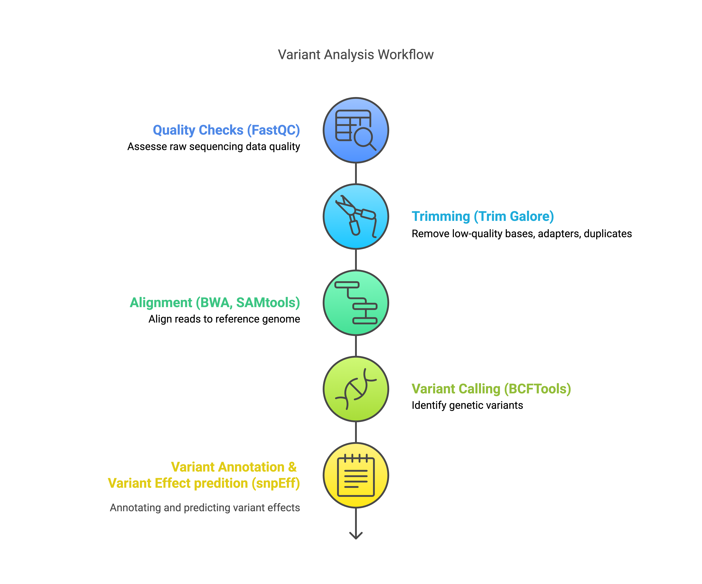
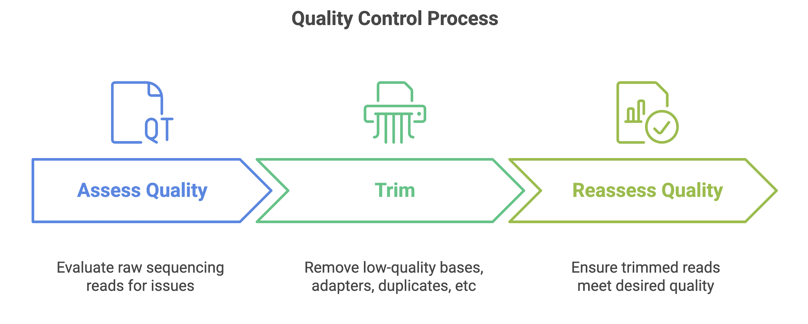
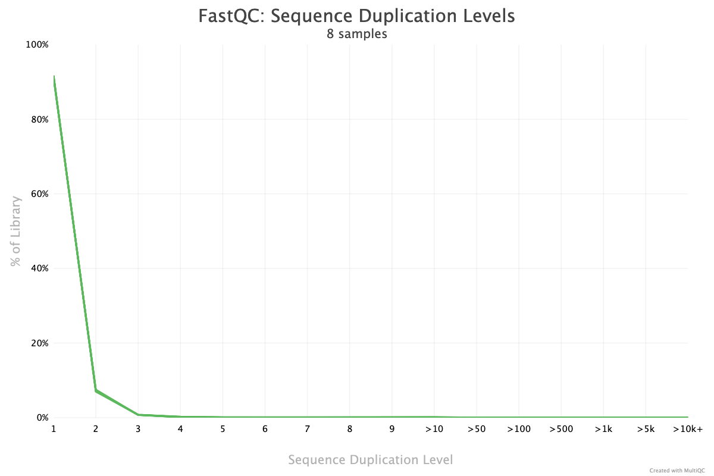
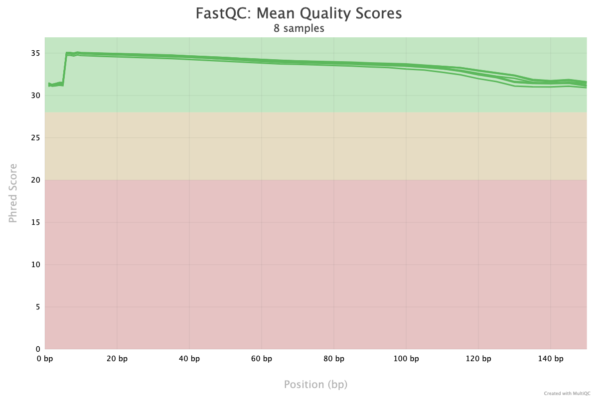
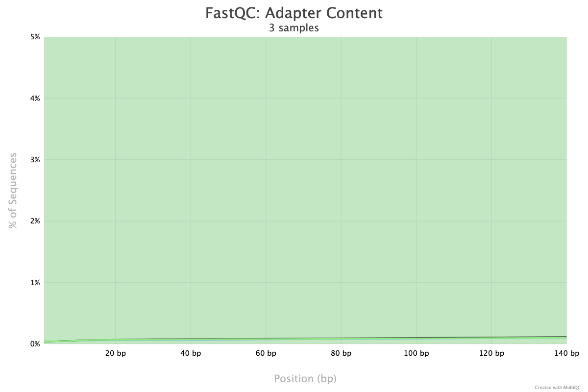
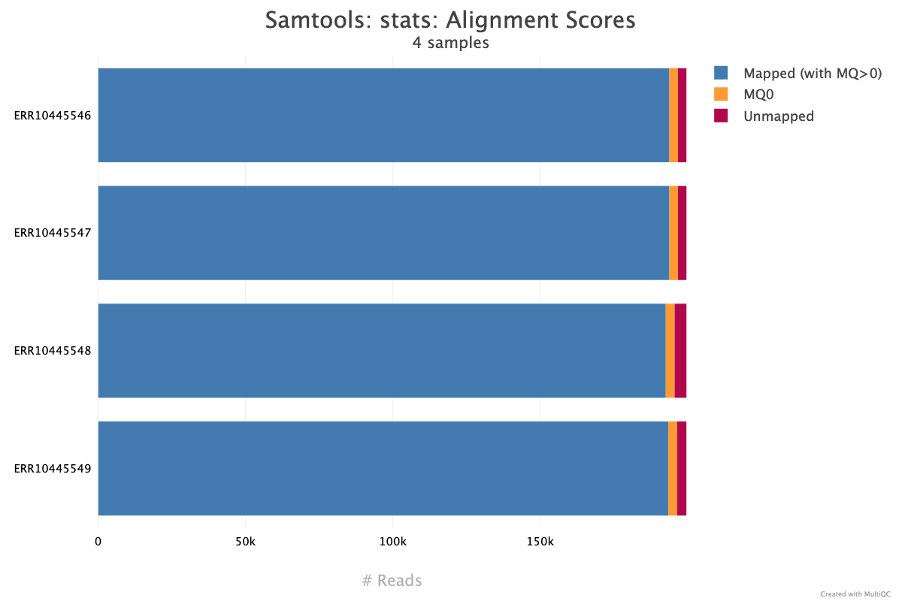
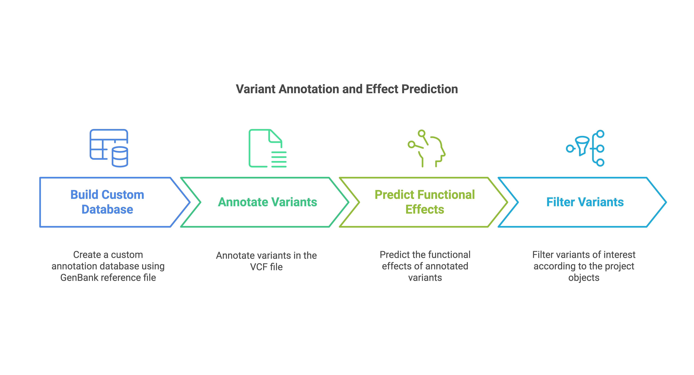

Automated bacterial variant analysis: Build a custom bash pipeline for
variant calling, annotation, and effect prediction
================

#### Okwir Julius - 2025-03-03

## Table of Contents

- [Introduction](##Introduction)
- [Installation/setup](##installation/setup)
- [Quality Control (Quality checks and
  trimming)](##Quality%20Control%20(Quality%20checks%20and%20trimming))
- [Alignment](##Alignment)
- [Variant calling](##Variant%20calling)
- [Variant Annotation and Effect
  Prediction](##Variant%20Annotation%20and%20Effect%20Prediction)
- [References](##References)

## Introduction

Variant calling is an important step in bioinformatics for identifying
genetic differences such as Single Nucleotide Polymorphisms (SNPs) and
small insertions or deletions (indels) in genomic sequences. These
variants can reveal important information about genetic diversity,
pathogenicity, and antibiotic resistance in bacterial genomes. For
beginners, think of variant calling as playing a game of “spot the
difference” between a sample and a reference genomic sequence. Variant
annotation pinpoints the regions or genes where these differences occur,
and variant effect prediction identifies their potential implications.


This beginner friendly tutorial offers a comprehensive step-by-step
guide for variant calling, annotation, and effect prediction in
bacterial genomes using *Salmonella enterica* as a case study. It uses
beginner level bash commands and emphasizes automation and
reproducibility with bash scripting to ease routine variant analysis
tasks. By the end, you will be able to:  
1. Perform variant analysis on bacterial samples  
2. Automate quality control, alignment, variant calling, annotation, and
effect prediction steps with custom bash scripts 3. Build a single
end-to-end automated custom bash pipeline for variant analysis

## Installation/setup

### Step 1: Install Anaconda (if absent)

[Anaconda](https://docs.anaconda.com/getting-started/#) is a popular
distribution of R and python that eases package management and
environments. It comes with the Conda package and environment manager.
Install Anaconda and use Conda to set up a dedicated environment with
all the tools needed for variant analysis.

``` bash
# Download the Anaconda installer for macOS (check for latest version)
curl -O https://repo.anaconda.com/archive/Anaconda3-2024.10-1-MacOSX-arm64.sh

# Download the Anaconda installer for Linux (check for latest version)
wget https://repo.anaconda.com/archive/Anaconda3-2024.10-1-Linux-x86_64.sh

# Run the installer for MacOS
bash ~/Anaconda3-2024.10-1-MacOSX-arm64.sh

# Run the installer for Linux
bash ~/Anaconda3-2024.10-1-Linux-x86_64.sh

# Follow the prompts to complete the installation
# Restart your terminal 

# Verify installation
conda --version
```

------------------------------------------------------------------------

### Step 2: Set up a dedicated Conda environment for variant analysis

Create an `environment.yml` file, which is a [YAML
file](https://www.redhat.com/en/topics/automation/what-is-yaml) with a
list of all the packages/tools that we need.

``` bash
# create a yaml file (use your favorite bash editor - nano, pico, vim etc)
nano environment.yml
```

Add environment name, channels, and dependencies or tools as shown
below, save the file and exit the editor.

``` bash
cat environment.yml
```

    name: variant_analysis  # name of the Conda environment

    channels:
      - bioconda         # channel providing bioinformatics tools/packages
      - conda-forge      # community-driven channel with additional packages and dependencies

    dependencies:
      - fastqc           # quality control tool for high-throughput sequence data
      - cutadapt         # trims adapter sequences from sequencing reads
      - trim-galore      # wrapper for quality and adapter trimming (uses Cutadapt)
      - multiqc          # aggregates results from various bioinformatics tools into a single report
      - bwa              # maps sequences to a reference genome
      - samtools         # manipulates SAM/BAM format files (e.g., sorting, indexing)
      - picard           # mark duplicate reads
      - bcftools         # variant calling and VCF/BCF file manipulation
      - snpeff           # annotates genetic variants and predicts their effects
      

Create and activate the `conda environment` with all the listed tools or
dependencies

``` bash
# create conda enviroment 
conda env create -f environment.yml

# activate conda environment
conda activate variant_analysis

# check the list of installed tools
conda list
```

### Step 3: Set up the directory structure with reference genome and samples

To perform variant analysis, you need a reference genome file,
annotation file , and the raw sequencing sample files. In this tutorial,
these files were obtained from [this
study](https://pmc.ncbi.nlm.nih.gov/articles/PMC10132074/#s4) and
downloaded from NCBI. The reference genome ([FASTA
format](https://www.ncbi.nlm.nih.gov/genbank/fastaformat/)) and
annotation file ([GenBank
format](https://www.ncbi.nlm.nih.gov/genbank/samplerecord/)) are
available [here](https://www.ncbi.nlm.nih.gov/nuccore/CP000026), while
the sample files ([FASTQ
format](https://knowledge.illumina.com/software/general/software-general-reference_material-list/000002211))
can be accessed
[here](https://www.ncbi.nlm.nih.gov/Traces/study/?query_key=13&WebEnv=MCID_6793311f4d895d5d7ca50eb7&o=acc_s%3Aa).
To reduce processing time, this tutorial uses only the first 100,000
reads from each sample and analyzes only four
[paired-end](https://www.illumina.com/science/technology/next-generation-sequencing/plan-experiments/paired-end-vs-single-read.html)
samples. The reference genome, annotation, and sample files are provided
as part of the tutorial.

``` bash
# Create the project directory 'vc_project' along with subdirectories 'raw_reads' and 'reference' 
mkdir vc_project vc_project/raw_reads vc_project/reference

# Change the working directory to 'vc_project'
# vc_project is the working directory throughout the entire analysis
cd vc_project

# Copy FASTQ sample files into the 'raw_reads' directory and the reference genome and annotation file into the 'reference' directory
```

##### Directories and files

``` bash
.
├── raw_reads                   # Directory with raw FASTQ samples
│   ├── ERR10445546_1.fastq.gz  # Forward reads for sample ERR10445546
│   ├── ERR10445546_2.fastq.gz  # Reverse reads for sample ERR10445546
│   ├── ERR10445547_1.fastq.gz  # Forward reads for sample ERR10445547
│   ├── ERR10445547_2.fastq.gz  # Reverse reads for sample ERR10445547
│   ├── ERR10445548_1.fastq.gz  # Forward reads for sample ERR10445548
│   ├── ERR10445548_2.fastq.gz  # Reverse reads for sample ERR10445548
│   ├── ERR10445549_1.fastq.gz  # Forward reads for sample ERR10445549
│   └── ERR10445549_2.fastq.gz  # Reverse reads for sample ERR10445549
└── reference                   # Directory with reference genome and annotation files
    ├── Salmonella_enterica.fasta  # Reference genome in FASTA format
    └── Salmonella_enterica.gb     # Reference genome in GenBank format (Annotation file)
```

------------------------------------------------------------------------

## The workflow



## Quality Control (Quality checks and trimming)

The quality control process typically involves three key steps:

- Assess the quality of the raw sequencing reads to identify potential
  issues such as low-quality bases, adapter contamination, or sequence
  duplication
- Trim low-quality bases, remove adapter sequences, remove duplicate
  sequences if necessary to improve the overall quality of the reads for
  downstream analyses  
- Reassess the quality of the trimmed reads to ensure they meet the
  necessary standards for downstream analyses.

These steps ensure that only high-quality reads are used in downstream
analyses, minimizing errors and improving the reliability of variant
calling results.

 In this tutorial, we will use the
following tools for quality control.

- [**FastQC**](https://www.bioinformatics.babraham.ac.uk/projects/fastqc/)-
  To perform quality checks for each raw sequencing file, providing
  detailed metrics such as per-base quality, per-sequence quality,
  Sequence duplication, and adapter contamination  
- [**MultiQC**](https://docs.seqera.io/multiqc)- To aggregate the
  results from multiple FastQC reports into a single, comprehensive
  summary, making it easier to identify patterns or trends across all
  samples  
- [**Trim Galore**](https://github.com/FelixKrueger/TrimGalore)- To trim
  low-quality bases and remove adapter sequences from the reads.
  `Trim Galore` is a wrapper around `cutadapt` and includes automated
  adapter detection

------------------------------------------------------------------------

### Step 1: Assess the quality of the raw sequencing reads with FastQC

Create the directory structure for storing the outputs of various stages
of the quality control process:

``` bash
# Create directories and subdirectories for QC reports and trimmed reads
mkdir -p raw_reads/qc_raw trimmed_reads/qc_trimmed
```

Command and options:

- `mkdir`: Command to create directories.  
- `-p`: Ensures that parent directories are created if they don’t exist
  and suppresses errors if directories already exist.

##### Directories

``` bash
.
├── raw_reads
│   └── qc_raw
├── reference
└── trimmed_reads
    └── qc_trimmed
```

Next, run FastQC on all raw FASTQ samples to assess their quality. Note
that FastQC assesses each file separately, so the forward and reverse
reads for each sample are evaluated independently.

``` bash
# Perform quality checks on raw reads
fastqc -o raw_reads/qc_raw raw_reads/*.fastq.gz
```

Command and options:

- `fastqc`: Command to perform quality checks
- `-o`: Specifies the output directory for FastQC results.

Finally, aggregate the FastQC reports using MultiQC.

``` bash
# Aggregate FastQC reports for raw reads
multiqc -f -o raw_reads/qc_raw -n multiqc_raw_report.html raw_reads/qc_raw
```

Command and options:

- `multiqc`: Command to combines multiple FastQC reports into a single
  HTML summary  
- `-f`: Overwrite any existing MultiQC report.
- `-o`: Specifies the output directory for the MultiQC report.
- `-n`: Specifies the name of the multiqc report

##### Directories

``` bash
.
├── raw_reads
│   └── qc_raw
│       └── multiqc_raw_report_data
├── reference
└── trimmed_reads
    └── qc_trimmed
```

#### Output

Key multiQC aggregated report sections from FastQC quality checks on all
the raw sequencing reads

1.  Per Base Sequence Quality Scores:
    - Shows the distribution of base quality scores across all reads
    - Helps identify regions containing [low-quality
      bases](https://www.bioinformatics.babraham.ac.uk/projects/fastqc/Help/3%20Analysis%20Modules/2%20Per%20Base%20Sequence%20Quality.html),
      with FastQC issuing a warning when the median base quality (Phred
      score) falls below 25 and a failure when it drops below 20. Low
      quality bases can result in misalignment and false variant calls
2.  Duplicate Sequences:
    - Reports the frequency of duplicate reads
    - A [high
      proportion](https://www.bioinformatics.babraham.ac.uk/projects/fastqc/Help/3%20Analysis%20Modules/8%20Duplicate%20Sequences.html)
      of duplicate sequences, indicated by FastQC warnings when
      exceeding 20% of total reads and failures when exceeding 50%, may
      indicate PCR over amplification or over-sequencing of certain
      fragments
3.  Adapter Contamination:
    - Shows the extent of adapter sequences present in the reads
    - [High levels of adapter
      contamination](https://www.bioinformatics.babraham.ac.uk/projects/fastqc/Help/3%20Analysis%20Modules/10%20Adapter%20Content.html),
      indicated by FastQC warnings when exceeding 5% and failures when
      exceeding 10% of all reads, can lead to alignment errors and an
      increase in the number of unaligned reads




 Based on the quality metrics
above, trimming low quality reads, adaptor removal, and deduplication
might not be strictly necessary. However, since the goal of this
tutorial is to build an end-to-end automated variant analysis pipeline,
This step is included.

------------------------------------------------------------------------

### Step 2: Trim low-quality bases and remove adapter sequences with Trim Galore

After reviewing the Quality control reports, clean the data by trimming
low-quality bases, removing adapter sequences, deduplication, etc if
necessary. Use Trim Galore to process the paired-end reads. Start by
running Trim Galore with a single sample to understand the command
syntax and then later incorporate the command into a custom quality
control bash script for processing multiple samples.

``` bash
# Trim low-quality bases and remove adapters
trim_galore --paired \
            --quality 20 \ # default quality score
            --output_dir trimmed_reads \
            raw_reads/ERR10445546_1.fastq.gz raw_reads/ERR10445546_2.fastq.gz
```

Command and options:

- `trim_galore`: Automatically detects and removes adapters, trims
  low-quality bases, and filters out short sequences.  
- `--paired`: Specifies paired-end mode to process the two input files
  simultaneously.  
- `--quality 20`: Trims bases with a Phred quality score \< 20 (99% base
  call accuracy).  
- `--output_dir`: Saves the trimmed FASTQ files in the `trimmed_reads`
  directory.

------------------------------------------------------------------------

### Step 3: Reassess the quality of the trimmed reads with FastQC

After trimming, reassess the quality of the trimmed reads to ensure they
are satisfactory. Use FastQC and MultiQC to generate and aggregate QC
reports respectively. Trim Galore also produces a quality assessment
report that can also be aggregated with MultiQC. Note that quality
checks on the trimmed reads can conveniently be performed directly by
specifying the `--fastqc` option in Trim Galore. Doing so will combine
steps 2 & 3 as indicated in the “Automate quality control” section.

``` bash
# move trim galore reports to the qc_trimmed directory
mv trimmed_reads/*_trimming_report.txt trimmed_reads/qc_trimmed

# Aggregate Trim Galore reports (optional)
multiqc -f -o trimmed_reads/qc_trimmed -n trim_galore_report.html trimmed_reads/qc_trimmed

# Perform quality checks on trimmed reads
fastqc -o trimmed_reads/qc_trimmed trimmed_reads/*.fq.gz

# Aggregate FastQC reports for trimmed reads
multiqc -o trimmed_reads/qc_trimmed -n multiqc_trimmed_report.html trimmed_reads/qc_trimmed
```

##### Directories

``` bash
.
├── raw_reads
│   └── qc_raw
│       └── multiqc_raw_report_data
├── reference
└── trimmed_reads
    └── qc_trimmed
        ├── multiqc_trimmed_report_data
        └── trim_galore_report_data
```

##### Output

Key multiqc report sections from FastQC quality checks on all trimmed
sequencing reads




 Note that not much has
changed after trimming because the raw reads were already of acceptable
quality for this analysis. —

### Automate Quality Control with a bash script

To ensure processing of multiple samples, create a new file in your
favorite editor and write a bash script (automate_qc.sh) that automates
the above process as shown below. The script incorperates most commands
from the Quality control section and should be familiar.

    #!/bin/bash

    # stop the script as soon as an error occurs
    set -euo pipefail

    #------------------------------description--------------------------------------
    # This script processes sequencing data by performing quality checks, trimming 
    # low-quality reads, and re-checking quality post-trimming.
    # It automatically detects samples from the "raw_reads" directory based on file
    # naming conventions. 
    # Supported naming patterns are _R1/_R2 or _1/_2
    #
    # Usage: bash automate_qc.sh
    #
    # Dependencies: fastqc, multiqc, trim_galore

    #---------------------------dependency checks-----------------------------------
    # Verify that required commands (tools) are installed and available in systems PATH
    for cmd in fastqc multiqc trim_galore; do
        if ! command -v "$cmd" &> /dev/null; then
            echo "Error: $cmd is not installed or not in PATH."
            exit 1
        fi
    done

    #---------------------------directory setup-------------------------------------
    # Define directories for raw reads, trimmed reads, and QC outputs
    raw_dir="raw_reads"
    trim_dir="trimmed_reads"
    qc_raw_dir="raw_reads/qc_raw"
    qc_trim_dir="trimmed_reads/qc_trimmed"

    # Create directories if absent.
    mkdir -p "$raw_dir" "$qc_raw_dir" "$trim_dir" "$qc_trim_dir"

    #---------------------------automate sample names detection---------------------
    # Use an array to store detected sample names
    samples=()

    # Detect samples with the "_R1" pattern
    for file in "$raw_dir"/*_R1*; do
        if [[ -f "$file" ]]; then
            base=$(basename "$file")
            # extract the sample name: everything before '_R1'
            sample="${base%%_R1*}"
            # add sampe name to samples array
            samples+=("$sample") 
        fi
    done

    # Detect samples with the "_1" pattern if samples array is still empty
    if [ ${#samples[@]} -eq 0 ]; then
        for file in "$raw_dir"/*_1*; do
            if [[ -f "$file" ]]; then
                base=$(basename "$file")
                # Extract the sample name: everything before '_1'
                sample="${base%%_1*}"
                # add sampe name to samples array
                samples+=("$sample")
            fi
        done
    fi

    # If still no samples are found, exit with an error
    if [ ${#samples[@]} -eq 0 ]; then
        echo "Error: No raw read files found in $raw_dir with expected naming patterns, \n
        e.g _R1/_R2 or _1/_2"
        exit 1
    fi

    #---------------------------Step 1: quality check on raw reads------------------
    echo "=========Performing quality checks on raw reads========="
    # Use 'find' to select only regular files in the raw_dir (ignore subdirectories)
    # and run FastQC on them
    fastqc -o "$qc_raw_dir" $(find "$raw_dir" -maxdepth 1 -type f)

    echo "=========Generating MultiQC report for raw reads========="
    # Generate a MultiQC report from the FastQC output. -f overwrites existing report
    multiqc -f -o "$qc_raw_dir" -n multiqc_raw_report.html "$qc_raw_dir"

    #------------------Steps 2&3: trim reads and check quality of trimmed reads-----
    echo "======Trimming reads and performing quality checks on trimmed reads======="
    # Loop through each detected sample
    for sample in "${samples[@]}"; do
        # Use the "_R1/_R2" naming pattern
        R1_files=( "$raw_dir/${sample}_R1"* )
        R2_files=( "$raw_dir/${sample}_R2"* )
        if [[ -f "${R1_files[0]}" && -f "${R2_files[0]}" ]]; then
            R1="${R1_files[0]}"
            R2="${R2_files[0]}"
        else
            # If not found, use the "_1/_2" naming pattern
            R1_files=( "$raw_dir/${sample}_1"* )
            R2_files=( "$raw_dir/${sample}_2"* )
            if [[ -f "${R1_files[0]}" && -f "${R2_files[0]}" ]]; then
                R1="${R1_files[0]}"
                R2="${R2_files[0]}"
            else
                echo "Warning: Paired files for sample '$sample' not found with expected patterns. Skipping."
                continue
            fi
        fi

        echo "Trimming and running FastQC on sample: $sample"
        # trim, run FastQC on trimmed output, and redirect fastqc output to $qc_trim_dir
        trim_galore --paired \
                    --quality 20 \
                    --fastqc \
                    --fastqc_args "-o ${qc_trim_dir}" \
                    --output_dir "${trim_dir}" \
                    "${R1}" "${R2}"
        
    done

    echo "=========Generating MultiQC report for trim-galore========="
    # move trim galore report from $trim_dir to $qc_trim_dir
    mv "$trim_dir"/*_trimming_report.txt "$qc_trim_dir"

    # generate report
    multiqc -f -o "$qc_trim_dir" -n trim_galore_report.html "$qc_trim_dir"

    echo "=========Generating MultiQC report for trimmed reads========="
    # Generate a MultiQC report for the FastQC output of the trimmed reads
    multiqc -f -o "$qc_trim_dir" -n multiqc_trimmed_report.html "$qc_trim_dir"

    #---------------------------Completion message---------------------------
    echo "=========Quality control completed========="
    echo "Inspect raw reads report in: $qc_raw_dir/multiqc_raw_report.html."
    echo "Inspect trimmed reads report in: $qc_trim_dir/multiqc_trimmed_report.html."
    echo "Inspect trim-galore report in: $qc_trim_dir/trim_galore_report.html."

------------------------------------------------------------------------

### Alternative Tools for Quality Control

1)  [**`fastp`**](https://github.com/OpenGene/fastp):  

- A fast all-in-one preprocessing and quality control for FastQ data
- Combines quality assessment, trimming, and report generation into a
  single step.  
- Key Features:
  - Filter low quality reads
  - Read deduplication  
  - Adapter removal

2)  [**`Trimmomatic`**](https://github.com/usadellab/Trimmomatic):  

- A common bioinformatics tool for read trimming with customizable
  options
- Offers more trimming parameters compared to Trim Galore
- Key Features:
  - Adapter removal with `ILLUMINACLIP`  
  - Trimming based on quality (`LEADING`, `TRAILING`, `SLIDINGWINDOW`)
  - Remove reads that are below specified length (`MINLEN`)

------------------------------------------------------------------------

### Quality Control tips

1.  **Review QC Metrics Carefully**: Pay attention to key metrics like
    per-base sequence quality, adapter contamination, and duplicate
    sequences. These can provide insights into potential issues with the
    sequencing data.
2.  **Adjust Trimming Parameters**: If you observe persistent
    low-quality regions in the reads, consider increasing the quality
    threshold (e.g., `--quality 30`). However, be cautious not to
    over-trim, as excessive trimming may remove valuable data.  
3.  **Use Custom Adapters**: If your sequencing platform or library
    preparation introduces unique adapters, specify them explicitly in
    Trim Galore using the `--adapter` option.

------------------------------------------------------------------------

## Alignment

After quality control, the next step is to align the trimmed reads to a
reference genome. Use [**`BWA`**](https://github.com/lh3/bwa) for
alignment and [**`SAMtools`**](https://www.htslib.org/doc/samtools.html)
for post-alignment processing.


### Step 1: Index the Reference Genome

Before aligning the reads, the reference genome must be indexed.
Indexing enables the alignment tool (BWA) to quickly search and map
sequencing reads to the reference genome, significantly improving
alignment efficiency.

``` bash
# Create directories to organize output
mkdir -p alignment alignment/stats

# Index the reference genome using BWA
bwa index reference/Salmonella_enterica.fasta
```

------------------------------------------------------------------------

### Step 2: Align Trimmed Reads to the Reference Genome

After indexing, align the trimmed paired-end reads to the reference
genome using the BWA-MEM algorithm.

``` bash
bwa mem -t 4 reference/Salmonella_enterica.fasta \
    trimmed_reads/ERR10445546_1_val_1.fq.gz trimmed_reads/ERR10445546_2_val_2.fq.gz \
    > alignment/ERR10445546.sam
```

Command and options:

- `bwa mem`: Runs the BWA-MEM algorithm, optimized for long reads
- `-t 4`: Specifies the number of threads for parallel processing
- `reference/Salmonella_enterica.fasta`: Path to the indexed reference
  genome
- `trimmed_reads/ERR10445546_1_val_1.fq.gz`: Forward (1) trimmed reads
- `trimmed_reads/ERR10445546_2_val_2.fq.gz`: Reverse (2) trimmed reads

------------------------------------------------------------------------

### Step 3: Post-Alignment Processing

Once the reads are aligned, several processing steps are required to
convert the [SAM
file](https://pmc.ncbi.nlm.nih.gov/articles/PMC2723002/) into a more
efficient
[BAM](https://support.illumina.com/help/BS_App_RNASeq_Alignment_OLH_1000000006112/Content/Source/Informatics/BAM-Format.htm)
format, sort it by genomic coordinates, mark duplicates, and index it
for downstream applications.

#### Convert SAM to Sorted BAM and mark duplicate sequences

``` bash
# Convert SAM to BAM and sort the BAM file
samtools view -S -b alignment/ERR10445546.sam | samtools sort -o alignment/ERR10445546.sorted.bam

# mark duplicate reads
picard MarkDuplicates -INPUT alignment/ERR10445546.sorted.bam \
                      -OUTPUT alignment/ERR10445546.sorted.dedup.bam \
                      -METRICS_FILE alignment/stats/ERR10445546.dedup.txt
```

Command and options:

- `samtools view -S -b`: Converts the SAM file to BAM format, reducing
  file size and improving processing speed
- `samtools sort`: Organise the BAM file by genomic coordinates for
  efficient querying and compatibility with downstream tools.
- `picard MarkDuplicates`: Mark duplicate reads
- `-INPUT`: Input sorted BAM file
- `-OUTPUT`: Output deduplicated BAM file
- `-METRICS`: Deduplication metrics

Marking duplicates prevents false-positive variant calls by
distinguishing PCR duplicate reads from true independent reads.

#### Index the Sorted BAM File

``` bash
# Index the sorted BAM file
samtools index alignment/ERR10445546.sorted.dedup.bam
```

Command and options: - `samtools index`: Creates an index for the sorted
BAM file, enabling rapid access to specific genomic regions without
scanning the entire BAM file.

#### Generate Alignment Statistics

We can generate alignment summary statistics with SAMtools `flagstat`
and detailed statistics with samtools `stats`

``` bash
# summary statistics
samtools flagstat alignment/ERR10445546.sorted.dedup.bam > alignment/stats/ERR10445546.flagstat

# detailed statistics
samtools stats alignment/ERR10445546.sorted.dedup.bam > alignment/stats/ERR10445546.stats

# aggregate alignment stats with multiqc
multiqc -f -o alignment/stats/ -n multiqc_alignment_report.html alignment/stats/
```

Command and options:

- `samtools flagstat`: Produces a summary of the alignment, including
  the total number of reads, mapped reads, and duplicates  
- `samtools stats`: Generates a detailed statistical report, including
  metrics like mapping quality, insert size metrics, and error rates

#### Directories

``` bash
.
├── alignment
│   └── stats
│       ├── multiqc_alignment_report_data
│       └── multiqc_data
├── raw_reads
│   └── qc_raw
│       └── multiqc_raw_report_data
├── reference
└── trimmed_reads
    └── qc_trimmed
        ├── multiqc_trimmed_report_data
        └── trim_galore_report_data
```

#### Output

Multiqc report sections from alignment and post alignment processing of
all trimmed sequencing reads



## 

### Automate aligment with a bash script

To ensure that we process multiple samples, the entire alignment process
can be automated with a bash script as shown below. The script
incorporates most commands from the Alignment section and should be
familiar.

    #!/bin/bash

    # stop the script as soon as an error occurs
    set -euo pipefail

    #-------------------------------description-------------------------------------
    # This script aligns trimmed reads to a reference genome using BWA.
    # It indexes the reference genome, aligns each sample, converts SAM files to
    # sorted BAM files, indexes the BAM files, and generates alignment statistics.
    # It automatically detects samples in the "trimmed_reads" directory based on file
    # naming conventions.
    # Supported naming patterns are sample_R1.fastq.gz / sample_R2.fastq.gz or 
    # sample_1.fastq.gz  / sample_2.fastq.gz
    #
    # Usage: bash automate_algnmnt.sh
    #
    # Dependencies: bwa, samtools

    #---------------------------dependency checks---------------------------
    # Verify that required commands (tools) are installed and available in systems PATH
    for cmd in bwa samtools picard; do
        if ! command -v "$cmd" &> /dev/null; then
            echo "Error: $cmd is not installed or not in PATH."
            exit 1
        fi
    done

    #---------------------------directory setup-------------------------------------
    # Automatically search for a FASTA (.fasta) or FNA (.fna) reference file in the "reference" directory.
    ref=$(find reference -maxdepth 1 -type f \( -iname "*.fasta" -o -iname "*.fna" \) | head -n 1)
    if [ -z "$ref" ]; then
        echo "Error: No reference file (.fasta or .fna) found in the 'reference' directory."
        exit 1
    fi
    echo "Using reference file: $ref"

    # Define directories for trimmed reads, alignment outputs, and statistics.
    trim_dir="trimmed_reads"
    align_dir="alignment"
    stats_dir="alignment/stats"

    # Create necessary directories if they do not exist.
    mkdir -p "$align_dir" "$stats_dir"

    #---------------------------automate sample names detection---------------------
    # Use an array to store detected sample names
    samples=()

    # Detect samples with the "_R1" pattern
    for file in "$trim_dir"/*_R1*; do
        if [[ -f "$file" ]]; then
            base=$(basename "$file")
            # extract the sample name: everything before '_R1'
            sample="${base%%_R1*}"
            # add sampe name to samples array
            samples+=("$sample") 
        fi
    done

    # Detect samples with the "_1" pattern if samples array is still empty
    if [ ${#samples[@]} -eq 0 ]; then
        for file in "$trim_dir"/*_1*; do
            if [[ -f "$file" ]]; then
                base=$(basename "$file")
                # Extract the sample name: everything before '_1'
                sample="${base%%_1*}"
                # add sampe name to samples array
                samples+=("$sample")
            fi
        done
    fi

    # Exit if no samples were detected.
    if [ ${#samples[@]} -eq 0 ]; then
        echo "Error: No trimmed read files found in $trim_dir with expected naming pattern."
        exit 1
    fi

    #-----------------Step 1: Index the Reference Genome----------------------------
    echo "==========Indexing reference genome: $ref=========="
    bwa index "$ref"

    #-----------------Steps 2&3: alignment and post-alignment processing------------
    # Loop through each detected sample
    for sample in "${samples[@]}"; do
        # Use the "_R1/_R2" naming pattern
        R1_files=( "$trim_dir/${sample}_R1"* )
        R2_files=( "$trim_dir/${sample}_R2"* )
        if [[ -f "${R1_files[0]}" && -f "${R2_files[0]}" ]]; then
            R1="${R1_files[0]}"
            R2="${R2_files[0]}"
        else
            # If not found, use the "_1/_2" naming pattern
            R1_files=( "$trim_dir/${sample}_1"* )
            R2_files=( "$trim_dir/${sample}_2"* )
            if [[ -f "${R1_files[0]}" && -f "${R2_files[0]}" ]]; then
                R1="${R1_files[0]}"
                R2="${R2_files[0]}"
            else
                echo "Warning: Paired files for sample '$sample' not found with expected patterns. Skipping."
                continue
            fi
        fi
        
        # Define file paths.
        sam_file="$align_dir/${sample}.sam"
        bam_file="$align_dir/${sample}.sorted.bam"
        dedup_bam="$align_dir/${sample}.sorted.dedup.bam"
        metrics_file="$stats_dir/${sample}.dedup.txt"
        
        # Align reads to the reference genome using bwa mem.
        echo "========= Aligning $sample to the reference genome ========="
        bwa mem -t 4 -R "@RG\tID:$sample\tSM:$sample\tPL:illumina" "$ref" "$R1" "$R2" > "$sam_file"
        
        # Convert SAM to coordinate-sorted BAM using samtools.
        echo "========= Converting SAM to sorted BAM for $sample ========="
        samtools view -S -b "$sam_file" | samtools sort -o "$bam_file"
        
        # Remove the intermediate SAM file.
        rm -f "$sam_file"
        
        # Mark duplicates using Picard.
        echo "========= Marking duplicates for $sample with Picard ========="
        picard MarkDuplicates -INPUT "$bam_file" -OUTPUT "$dedup_bam" -METRICS_FILE "$metrics_file"

        # Index the deduplicated BAM file.
        echo "========= Indexing deduplicated BAM file for $sample ========="
        samtools index "$dedup_bam"
        
        # Generate alignment statistics on the deduplicated BAM file.
        echo "========= Generating alignment statistics for $sample ========="
        samtools flagstat "$dedup_bam" > "$stats_dir/${sample}.flagstat"
        samtools stats "$dedup_bam" > "$stats_dir/${sample}.stats"
    done

    echo "=========Generating MultiQC report for alignment========="
    # aggregate alignment statistics
    multiqc -f -o $stats_dir -n multiqc_alignment_report.html $stats_dir

    #---------------------------Create BAM List---------------------------
    # Create a text file listing all deduplicated BAM files.
    bam_list="$align_dir/bam_list.txt"
    echo "========= Creating bam_list.txt ========="
    ls "$align_dir"/*.sorted.dedup.bam > "$bam_list"
    echo "bam_list.txt created at $bam_list"

    #---------------------------Completion Message---------------------------
    echo "========= Alignment completed ========="
    echo "Check deduplicated BAM files in: $align_dir and alignment statistics in: $stats_dir"

        

------------------------------------------------------------------------

### Alternative Tools for Alignment

1.  [**`Bowtie2`**](https://bowtie-bio.sourceforge.net/bowtie2/index.shtml):
    - A common tool for aligning sequencing reads to long reference
      sequences.
2.  [**`minimap2`**](https://github.com/lh3/minimap2):
    - Recommended for aligning long reads from Oxford Nanopore or
      PacBio.

------------------------------------------------------------------------

### Tips for Alignment

1.  **Use Sufficient Threads**: Adjust the `-t` option in `bwa mem` to
    match the number of available CPU cores for faster alignment.
2.  **Monitor Output File Sizes**: SAM files are large; convert to BAM
    format immediately to save storage space.
3.  **Check for Read Group Information**: Add read group information
    (e.g., `@RG`) during alignment for multi-sample workflows.

------------------------------------------------------------------------

## Variant calling

After aligning the reads to the reference genome, the next step is to
perform variant calling to identify genetic variations such as SNPs
(Single Nucleotide Polymorphisms) and indels (insertions/deletions). Use
[BCFtools](https://samtools.github.io/bcftools/howtos/index.html) for
variant calling and processing. BCFtools generates a BCF file, which is
the binary version of a [VCF
file](https://pmc.ncbi.nlm.nih.gov/articles/PMC3137218/). The BCF file
is more compact and can be processed efficiently. If needed, the BCF
file can be converted to the more widely used VCF file for downstream
analysis.


### Step 1: Generate a Raw BCF File with BCFtools mpileup and call variants

Create a directory to store the variant calling results.

``` bash
# Create a directory to organize output
mkdir -p variants
```

To call variants, first generate a pileup of aligned reads using
`bcftools mpileup`.

``` bash
# Generate a raw BCF file with BCFtools mpileup
bcftools mpileup -Ou -f reference/Salmonella_enterica.fasta alignment/ERR10445546.sorted.dedup.bam > variants/variants.bcf
```

Command and options:

- `bcftools mpileup`: Computes the pileup of reads and generates an
  intermediate BCF file
- `-Ou`: Outputs an uncompressed BCF file for efficient downstream
  processing
- `-f reference/Salmonella_enterica.fasta`: Specifies the reference
  genome to ensure correct variant calling

Use `bcftools call` to identify SNPs and indels from the raw BCF file.

``` bash
# Call variants
bcftools call -mv --ploidy 1 -Ob -o variants/called_variants.bcf variants/variants.bcf
```

Command and options:

- `bcftools call`: Calls genetic variants from the BCF file.
- `-mv`: Calls both SNPs and indels, allowing for multiallelic sites.
- `--ploidy 1`: Specifies a haploid genome, which is appropriate for
  bacteria and other prokaryotes
- `-Ob`: Outputs a compressed BCF file for storage efficiency.

### Step 2: Convert BCF to VCF for Easier Interpretation

Since the VCF file is more widely used, convert the BCF file to VCF.

``` bash
# Convert BCF to VCF
bcftools view variants/called_variants.bcf > variants/called_variants.vcf
```

Command and options:

- `bcftools view`: Converts the BCF file to VCF format, making it
  human-readable

### Step 3: Index the final VCF File and generate variant calling statistics

Indexing the VCF file allows for faster querying and efficient
downstream processing.

``` bash
# create a compressed vcf file
bgzip -c variants/called_variants.vcf > variants/called_variants.vcf.gz

# Index the VCF file
bcftools index variants/called_variants.vcf.gz
```

Command and tools:

- `bcftools index`: Creates an index file for the VCF file, enabling
  rapid querying of variants.

``` bash
# Generate stats
bcftools stats $variants_dir/called_variants.vcf.gz > $variants_dir/bcf_stats.txt
```

------------------------------------------------------------------------

##### Directory and files

``` bash
variants
├── bcf_stats.txt              # Statistics from variant calling 
├── called_variants.bcf        # Called variants in binary BCF format generated by bcftools call
├── called_variants.vcf        # Human-readable VCF file converted from the binary BCF output
├── called_variants.vcf.gz     # Compressed VCF file (BGZF format) for efficient storage and downstream processing
├── called_variants.vcf.gz.csi # Index file for the compressed VCF, enabling rapid access to variant data
└── variants.bcf               # Raw BCF file produced by bcftools mpileup from the alignment data
```

### Automate variant calling with a bash script

To call variants from multiple samples, the variant calling process can
be automated with a bash script as shown below.

    #!/bin/bash

    # stop the script as soon as an error occurs
    set -euo pipefail

    #----------------------------- Description -----------------------------
    # This script performs variant calling using BCFtools.
    # It generates a raw BCF file from alignment BAM files listed in a bam_list,
    # calls variants with ploidy set to 1 (appropriate for haploid organisms),
    # converts the BCF output to VCF format, compresses and indexes the final VCF,
    # and generates variant statistics.
    #
    # Usage: bash automate_vc.sh
    #
    # Dependencies: bcftools, bgzip

    #----------------------------dependency checks----------------------------------
    for cmd in bcftools bgzip; do
        if ! command -v "$cmd" &> /dev/null; then
            echo "Error: $cmd is not installed or not in PATH."
            exit 1
        fi
    done

    #---------------------------directory setup-------------------------------------
    # Automatically search for a FASTA (.fasta) or FNA (.fna) reference file in the "reference" directory.
    ref=$(find reference -maxdepth 1 -type f \( -iname "*.fasta" -o -iname "*.fna" \) | head -n 1)
    if [ -z "$ref" ]; then
        echo "Error: No reference file (.fasta or .fna) found in the 'reference' directory."
        exit 1
    fi
    echo "Using reference file: $ref"

    # Define directories alignment
    align_dir="alignment"
    bam_list="$align_dir/bam_list.txt"
    variants_dir="variants"

    # Create necessary directories if they do not exist.
    mkdir -p "$variants_dir" 

    #--------------------------- Step 1: Generate raw BCF file ---------------------------
    echo "========== Generating raw BCF file =========="
    # Generate a BCF file from the list of BAM files using bcftools mpileup.
    bcftools mpileup -Ou -f "$ref" -b "$bam_list" > "$variants_dir/variants.bcf"

    #--------------------------- Step 2: Call Variants ---------------------------
    echo "========== Calling variants with ploidy level set to 1 =========="
    # Call variants from the raw BCF file with ploidy set to 1 (haploid).
    bcftools call -mv --ploidy 1 -Ob -o "$variants_dir/called_variants.bcf" "$variants_dir/variants.bcf"

    #--------------------------- Step 2: Convert BCF to VCF ------------------------
    echo "========== Converting BCF to VCF format =========="
    # Convert the BCF output to VCF format.
    bcftools view "$variants_dir/called_variants.bcf" > "$variants_dir/called_variants.vcf"

    #------------------- Step 3: Index final VCF and generate stats ----------------
    echo "========== Compressing and indexing the final VCF file =========="
    # Compress the VCF file with bgzip and then index it with bcftools.
    bgzip -c "$variants_dir/called_variants.vcf" > "$variants_dir/called_variants.vcf.gz"
    bcftools index "$variants_dir/called_variants.vcf.gz"

    # Generate statistics on the final VCF file.
    bcftools stats "$variants_dir/called_variants.vcf.gz" > "$variants_dir/bcf_stats.txt"

    #--------------------------- Completion Message ---------------------------
    echo "========== Variant calling completed successfully =========="
    echo "Check VCF file and statistics in: $variants_dir"

------------------------------------------------------------------------

### Alternative Tools for Variant Calling

1.  [**`GATK HaplotypeCaller`**](https://gatk.broadinstitute.org/hc/en-us/articles/360037225632-HaplotypeCaller):

    - More advanced variant caller commonly used for diploid genomes but
      can be applied to prokaryotes.

2.  [**`FreeBayes`**](https://github.com/freebayes/freebayes): -Popular
    variant caller used with haploid or polyploid genomes to detect
    SNPs, indels, MNPs, insertions and substitutions

3.  [**`LoFreq`**](https://csb5.github.io/lofreq/):

    - High-sensitivity variant caller that can be optimized to cater for
      low quality variants.

### Tips for Variant calling

1.  **Adjust Variant Calling Sensitivity**: Use `--variants-only` to
    remove non-variant sites
2.  **Compress and Index VCF for Storage Efficiency**: Convert the VCF
    file to BGZF format using `bcftools view -Oz` and index it with
    `bcftools index`.
3.  **Check Variant Quality**: Use `bcftools filter` to retain
    high-confidence variants (e.g., `QUAL > 30`).

------------------------------------------------------------------------

## Variant Annotation and Effect Prediction

After variant calling, the next step is to annotate the variants and
predict their functional effects. We will use SnpEff for annotation and
effect prediction, and BCFtools for filtering variants of interest.



### Step 1: Build a Custom Database with SnpEff

[SnpEff](https://pcingola.github.io/SnpEff/) requires an annotation
database to annotate variants. If a database for your organism is not
available (very unlikely), you need to build a custom database. We will
use the GenBank reference file to build a custom database.

#### Copy and modify SnpEff configuration file

The **SnpEff configuration file** (`snpEff.config`) is usually found in
the SnpEff installation directory. Create a copy of this file and modify
it to include our organism. Using a copy of the snpEff.config file
ensures that the original configuration file and functionality of snpEff
is not tampered with.

``` bash
# Create output directory
mkdir -p annotation

# Copy SnpEff configuration file from snpEff installation directory into the annotation directory
cp /Users/oj/anaconda3/pkgs/snpeff-5.2-hdfd78af_1/share/snpeff-5.2-1/snpEff.config annotation/snpEff_copy.config
```

#### Edit the Configuration File

“Add an entry” for the organism at the end of the copied configuration
file.

``` bash
# Append custom genome entry to the config file
echo "# Salmonella enterica" >> annotation/snpEff_copy.config
echo "Salmonella_enterica.genome : Salmonella enterica, complete genome" >> annotation/snpEff_copy.config
```

#### Prepare Data Directory and Copy Reference Genome

For this approach, SnpEff requires the reference genome in **GenBank
(.gbk) format**. Create a directory for the organism and place the
reference file inside this directory.

``` bash
# Create directory structure for custom database
mkdir -p annotation/data annotation/data/Salmonella_enterica

# Copy the reference genome to the new directory
cp reference/Salmonella_enterica.gb annotation/data/Salmonella_enterica/genes.gbk
```

#### Build the Custom Database

Now, build the SnpEff database using the **GenBank reference file**.

``` bash
# Build the SnpEff database
snpEff build -genbank -c annotation/snpEff_copy.config -v Salmonella_enterica
```

Command and options:

- `snpEff build`: Builds a custom annotation database.
- `-genbank`: Specifies that the reference is in GenBank format.
- `-c annotation/snpEff_copy.config`: Uses our modified configuration
  file.
- `-v`: Enables verbose output to monitor progress.
- `Salmonella_enterica`: The custom genome name added in the
  configuration file.

------------------------------------------------------------------------

### Step 2: Annotate and Predict Effect of Variants

Once the database is built, we can annotate the called variants (VCF
file).

``` bash
# Annotate variants and predict functional effects
snpEff ann -o vcf -c annotation/snpEff_copy.config Salmonella_enterica /variants/called_variants.vcf.gz > annotation/ann_called_variants.vcf
```

Command and options:

- `snpEff ann`: Runs annotation on the variant file.
- `-o vcf`: Outputs results in VCF format.
- `-c annotation/snpEff_copy.config`: Uses the custom database
  configuration.
- `Salmonella_enterica`: The genome name specified during database
  creation.
- `../variants/called_variants.vcf.gz`: The input VCF file from variant
  calling.

------------------------------------------------------------------------

### Automate variant annotation and effect prediction

We can automate the entire process of annotation and effect prediction
using a custom database with a bash script as shown below.

    #!/bin/bash

    # stop the script as soon as an error occurs
    set -euo pipefail

    #----------------------------- Description -----------------------------
    # This script builds a custom snpEff database and annotates variants.
    # It uses a reference GenBank file to automatically derive organism details,
    # constructs a custom snpEff database, modifies the snpEff configuration file,
    # and then annotates variants in a VCF file to predict their effects.
    #
    # Usage: bash annotate_variants.sh
    #
    # Dependencies: snpEff, Java

    #---------------------------dependency checks ---------------------------
    # Check for Java, which is required to run snpEff.
    for cmd in java snpEff; do
        if ! command -v "$cmd" &> /dev/null; then
            echo "Error: $cmd is not installed or not in PATH."
            exit 1
        fi
    done

    #---------------------------Files and directory setup ---------------------------
    # Automatically search for a GenBank (.gb) reference file in the "reference" directory.
    ref_gb=$(find reference -maxdepth 1 -type f -name "*.gb" | head -n 1)
    if [ -z "$ref_gb" ]; then
        echo "Error: No GenBank reference file (.gb) found in the 'reference' directory."
        exit 1
    fi
    echo "Using reference GenBank file: $ref_gb"

    # Automatically extract organism details from the ref_gb filename.
    # For example, if ref_gb is "Salmonella_enterica.gb":
    #   - ref_base becomes "Salmonella_enterica"
    #   - organ_db is set to "Salmonella_enterica"
    #   - organism is converted to "Salmonella enterica"
    #   - genome is set to "Salmonella enterica.genome"
    ref_base=$(basename "$ref_gb" .gb)
    organ_db="$ref_base"
    organism="${ref_base//_/ }"
    genome="${organism}.genome"

    # automatically detect the snpEff configuration file using the Conda packages directory
    # Search the conda pkgs directory relative to CONDA_PREFIX
    snpeff_config=$(find "$(dirname "$(dirname "$CONDA_PREFIX")")/pkgs" -type f -name "snpEff.config" | head -n 1)
    if [ -z "$snpeff_config" ]; then
        echo "Error: Could not locate snpEff configuration file."
        exit 1
    fi
    echo "Using snpEff configuration file: $snpeff_config"

    # set path to config file manually in case of error
    # snpeff_config="path/to/snpEff.config" 

    # Define other directories and configuration.
    variants_dir="variants"                   
    annotation_dir="annotation"                   

    # Create necessary output directories for annotation.
    mkdir -p "$annotation_dir/data/$organ_db"

    #--------------------------- Build Custom snpEff Database ---------------------------
    # Copy the GenBank file into the snpEff data directory for the organism.
    cp "$ref_gb" "$annotation_dir/data/$organ_db/genes.gbk"

    # Copy the snpEff configuration file to the annotation directory for modification.
    cp "$snpeff_config" "$annotation_dir/snpeff_copy.config"

    # Append organism and genome information to the copied snpEff configuration file.
    echo "# $organism" >> "$annotation_dir/snpeff_copy.config"
    echo "$genome : $organism, complete genome" >> "$annotation_dir/snpeff_copy.config"

    # Build the custom snpEff database using the GenBank file.
    snpEff build -genbank -c "$annotation_dir/snpeff_copy.config" -v "$organ_db"

    #--------------------------- Annotation and Effect Prediction ---------------------------
    # Annotate variants and predict their effects using the custom database.
    # The final VCF is written to "ann_called_variants.vcf" in the annotation directory
    snpEff ann -o vcf \
               -stats "$annotation_dir/snpEff_summary.html" \
               -c "$annotation_dir/snpeff_copy.config" "$organ_db" "$variants_dir/called_variants.vcf.gz" > \
               "$annotation_dir/ann_called_variants.vcf"


    #--------------------------- Completion Message ---------------------------
    echo "Annotation and effect prediction completed successfully."
    echo "Check final VCF file in $annotation_dir/ann_called_variants.vcf"
    echo "Check snpEff and Genes summary files in $annotation_dir directory"

### Step 3: Filter variants of interest with BCFtools

BCFtools provides multiple filtering options to extract specific
**high-confidence or functionally relevant** variants as per the
objectives of your project/research.

#### Example 1: Filter variants by type

``` bash
# Extract SNPs
bcftools view -v snps annotation/ann_called_variants.vcf > annotation/snps_only.vcf

# Extract indels
bcftools view -v indels annotation/ann_called_variants.vcf > annotation/indels_only.vcf

# confirm the number of variants
cat annotation/snps_only.vcf | grep -v "^#" | wc -l

cat annotation/indels_only.vcf | grep -v "^#" | wc -l
```

#### Example 2: Filter Variants by impact

``` bash
# Extract variants with HIGH impact
bcftools filter -i 'INFO/ANN~"HIGH"' annotation/ann_called_variants.vcf > annotation/high_impact_variants.vcf

# Extract variants with MODERATE impact
bcftools filter -i 'INFO/ANN~"MODERATE"' annotation/ann_called_variants.vcf > annotation/moderate_impact_variants.vcf

# Extract variants with LOW impact
bcftools filter -i 'INFO/ANN~"LOW"' annotation/ann_called_variants.vcf > annotation/low_impact_variants.vcf
```

#### Example 3: Filter variants by functional class

``` bash
# Extract non-synonymous variants (missense)
bcftools filter -i 'INFO/ANN~"missense_variant"' annotation/ann_called_variants.vcf > annotation/missense_variants.vcf

# Extract synonymous variants (silent)
bcftools filter -i 'INFO/ANN~"synonymous_variant"' annotation/ann_called_variants.vcf > annotation/synonymous_variants.vcf

# Extract nonsense variants (stop-gain)
bcftools filter -i 'INFO/ANN~"stop_gained"' annotation/ann_called_variants.vcf > annotation/stop_gained_variants.vcf
```

#### Example 4: Filter Variants in Specific Gene

``` bash
# Filter variants located in gene gyrA
bcftools filter -i 'INFO/ANN~"gyrA"' annotation/ann_called_variants.vcf > annotation/gyrA_variants.vcf
```

#### Example 5: Filter Variants with Quality Score ≥ 30

``` bash
# Filter variants with QUAL ≥ 30
bcftools filter -i "QUAL >= 30" annotation/ann_called_variants.vcf > annotation/high_quality_variants.vcf
```

#### Example 6: Combine multiple filters

``` bash
# Extract SNPs with QUAL>=30 and are missense variants
bcftools filter -i 'TYPE="snp" && QUAL>=30 && INFO/ANN~"missense_variant"' annotation/ann_called_variants.vcf

# Extract SNPs of HIGH impact and are missense variants
bcftools filter -i 'TYPE="snp" && INFO/ANN~"HIGH" && INFO/ANN~"missense_variant"' annotation/ann_called_variants.vcf
```

------------------------------------------------------------------------

### Alternative Tools for Variant Annotation and effect prediction

1.  [**`VEP (Variant Effect Predictor)`**](https://www.ensembl.org/info/docs/tools/vep/script/vep_options.html):
    - Developed by Ensembl, supports extensive annotations.
2.  [**`ANNOVAR`**](https://github.com/WGLab/doc-ANNOVAR):
    - Widely used for functional annotation of variants from diverse
      genomes
3.  [**`BCFtools csq`**](https://samtools.github.io/bcftools/bcftools.html#csq):
    - Provides simple and fast annotations

------------------------------------------------------------------------

### Tips for variant annotation and effect prediction

1.  **Ensure database completeness**. Check that the GenBank file
    contains CDS annotations; otherwise, functional predictions may be
    missing
2.  **Combine Multiple Filters**. Use `&& (AND)` and `|| (OR)`
    conditions in `bcftools filter` to refine your variant selection.
3.  **Create and Use a Copy of the snpEff Configuration File**. Before
    making any modifications, create a duplicate of the snpEff
    configuration file. Customize and use this copied version for your
    analysis, while preserving the original file unchanged for future
    reference

### Automate Bacterial Variant Analysis

Integrating all steps—quality control, alignment and post-alignment
processing, variant calling, variant annotation, and effect
prediction—into a single bash script creates a comprehensive, end-to-end
bacterial variant analysis pipeline. The one script to rule them all.

    #!/bin/bash
    set -euo pipefail

    #---------------------------------Description-----------------------------------
    # End-to-End Variant Analysis Pipeline
    #
    # This script performs the following steps:
    # 1. Quality control and trimming of raw sequencing reads.
    # 2. Alignment of trimmed reads to a reference genome, duplicate marking,
    #    and generation of alignment statistics.
    # 3. Variant calling using bcftools.
    # 4. Annotation and effect prediction using snpEff.
    #
    # Dependencies: fastqc, multiqc, trim_galore, bwa, samtools, picard, bcftools,
    #               bgzip, snpEff, Java.
    #
    # Usage: bash end_to_end_variant_analysis.sh

    #------------------------------Dependency Checks-----------------------------------
    # Verify that required commands (tools) are installed and available in systems PATH
    for cmd in fastqc multiqc trim_galore bwa samtools picard bcftools bgzip java snpEff; do
        if ! command -v "$cmd" &> /dev/null; then
            echo "Error: $cmd is not installed or not in PATH."
            exit 1
        fi
    done

    #--------------------------------Directory Setup------------------------------------
    # Define directories for raw reads, trimmed reads, alignment, variants, and annotation.
    raw_dir="raw_reads"
    trim_dir="trimmed_reads"
    qc_raw_dir="raw_reads/qc_raw"
    qc_trim_dir="trimmed_reads/qc_trimmed"
    align_dir="alignment"
    stats_dir="$align_dir/stats"
    variants_dir="variants"
    annotation_dir="annotation"

    # Create directories if they do not exist
    mkdir -p "$raw_dir" "$qc_raw_dir" "$trim_dir" "$qc_trim_dir" "$align_dir" "$stats_dir" "$variants_dir" "$annotation_dir"


    #-------------------------Step 1: Quality Control & Trimming-------------------------
    echo "===================Performing quality checks on raw reads===================="
    # Run FastQC on all regular files in raw_dir.
    fastqc -o "$qc_raw_dir" $(find "$raw_dir" -maxdepth 1 -type f)

    echo "===========Generating MultiQC Report for Raw Reads==========================="
    multiqc -f -o "$qc_raw_dir" -n multiqc_raw_report.html "$qc_raw_dir"

    # Detect sample names using "_R1" or "_1" patterns.
    samples=()
    for file in "$raw_dir"/*_R1*; do
        if [[ -f "$file" ]]; then
            base=$(basename "$file")
            sample="${base%%_R1*}"
            samples+=("$sample")
        fi
    done
    if [ ${#samples[@]} -eq 0 ]; then
        for file in "$raw_dir"/*_1*; do
            if [[ -f "$file" ]]; then
                base=$(basename "$file")
                sample="${base%%_1*}"
                samples+=("$sample")
            fi
        done
    fi
    if [ ${#samples[@]} -eq 0 ]; then
        echo "Error: No raw read files found in $raw_dir with expected naming patterns (_R1/_R2 or _1/_2)."
        exit 1
    fi


    echo "==========Trimming reads and performing quality checks on trimmed reads=========="
    for sample in "${samples[@]}"; do
        # Try _R1/_R2 pattern; if not, try _1/_2.
        R1_files=( "$raw_dir/${sample}_R1"* )
        R2_files=( "$raw_dir/${sample}_R2"* )
        if [[ -f "${R1_files[0]}" && -f "${R2_files[0]}" ]]; then
            R1="${R1_files[0]}"
            R2="${R2_files[0]}"
        else
            R1_files=( "$raw_dir/${sample}_1"* )
            R2_files=( "$raw_dir/${sample}_2"* )
            if [[ -f "${R1_files[0]}" && -f "${R2_files[0]}" ]]; then
                R1="${R1_files[0]}"
                R2="${R2_files[0]}"
            else
                echo "Warning: Paired files for sample '$sample' not found. Skipping."
                continue
            fi
        fi

        echo "Trimming sample: $sample"
        trim_galore --paired \
                    --quality 20 \
                    --fastqc \
                    --fastqc_args "-o ${qc_trim_dir}" \
                    --output_dir "${trim_dir}" \
                    "$R1" "$R2"
    done

    echo "========== Generating MultiQC Reports for Trimmed Reads =========="
    mv "$trim_dir"/*_trimming_report.txt "$qc_trim_dir"
    multiqc -f -o "$qc_trim_dir" -n trim_galore_report.html "$qc_trim_dir"
    multiqc -f -o "$qc_trim_dir" -n multiqc_trimmed_report.html "$qc_trim_dir"

    echo "Quality control and trimming completed."
    echo "Inspect raw reads report: $qc_raw_dir/multiqc_raw_report.html"
    echo "Inspect trimmed reads report: $qc_trim_dir/multiqc_trimmed_report.html"
    echo "Inspect trim-galore report: $qc_trim_dir/trim_galore_report.html"

    #-------------------Step 2: Alignment & Post-Alignment Processing-----------------
    # Automatically detect a reference file in FASTA (.fasta or .fna) format.
    ref=$(find reference -maxdepth 1 -type f \( -iname "*.fasta" -o -iname "*.fna" \) | head -n 1)
    if [ -z "$ref" ]; then
        echo "Error: No reference file (.fasta or .fna) found in the 'reference' directory."
        exit 1
    fi
    echo "Using reference file: $ref"

    echo "=========================Indexing Reference Genome========================"
    bwa index "$ref"

    # trimmed reads
    for sample in "${samples[@]}"; do
        # Use _R1/_R2 or _1/_2 pattern for trimmed reads.
        R1_files=( "$trim_dir/${sample}_1_val_1."* )
        R2_files=( "$trim_dir/${sample}_2_val_2."* )
        if [[ -f "${R1_files[0]}" && -f "${R2_files[0]}" ]]; then
            R1="${R1_files[0]}"
            R2="${R2_files[0]}"
        else
            R1_files=( "$trim_dir/${sample}_R1"* )
            R2_files=( "$trim_dir/${sample}_R2"* )
            if [[ -f "${R1_files[0]}" && -f "${R2_files[0]}" ]]; then
                R1="${R1_files[0]}"
                R2="${R2_files[0]}"
            else
                echo "Warning: Paired trimmed files for sample '$sample' not found. Skipping."
                continue
            fi
        fi

        sam_file="$align_dir/${sample}.sam"
        bam_file="$align_dir/${sample}.sorted.bam"
        dedup_bam="$align_dir/${sample}.sorted.dedup.bam"
        metrics_file="$stats_dir/${sample}.dedup.txt"

        echo "=================Aligning sample $sample==========================="
        bwa mem -t 4 -R "@RG\tID:$sample\tSM:$sample\tPL:illumina" "$ref" "$R1" "$R2" > "$sam_file"

        echo "========== Converting SAM to Sorted BAM for $sample =========="
        samtools view -S -b "$sam_file" | samtools sort -o "$bam_file"
        rm -f "$sam_file"

        echo "========== Marking Duplicates for $sample using Picard =========="
        picard MarkDuplicates -INPUT "$bam_file" -OUTPUT "$dedup_bam" -METRICS_FILE "$metrics_file"

        echo "========== Indexing Deduplicated BAM for $sample =========="
        samtools index "$dedup_bam"

        echo "========== Generating Alignment Statistics for $sample =========="
        samtools flagstat "$dedup_bam" > "$stats_dir/${sample}.flagstat"
        samtools stats "$dedup_bam" > "$stats_dir/${sample}.stats"
    done

    echo "========== Generating MultiQC Report for Alignment =========="
    multiqc -f -o "$stats_dir" -n multiqc_alignment_report.html "$stats_dir"

    # Create a list of deduplicated BAM files.
    bam_list="$align_dir/bam_list.txt"
    echo "========== Creating BAM List =========="
    ls "$align_dir"/*.sorted.dedup.bam > "$bam_list"
    echo "BAM list created at: $bam_list"

    #-----------------------Step 3: Variant Calling---------------------------------
    echo "==================================Variant Calling========================="

    # Use the same reference FASTA file as for alignment
    echo "Using reference file: $ref"

    echo "====================Generating raw BCF file==============================="
    bcftools mpileup -Ou -f "$ref" -b "$bam_list" > "$variants_dir/variants.bcf"

    echo "========== Calling Variants with ploidy set to 1=========================="
    bcftools call -mv --ploidy 1 -Ob -o "$variants_dir/called_variants.bcf" "$variants_dir/variants.bcf"

    echo "========================Converting BCF to VCF============================="
    bcftools view "$variants_dir/called_variants.bcf" > "$variants_dir/called_variants.vcf"

    echo "========================Compressing and Indexing VCF======================"
    bgzip -c "$variants_dir/called_variants.vcf" > "$variants_dir/called_variants.vcf.gz"
    bcftools index "$variants_dir/called_variants.vcf.gz"

    echo "===========================Generating Variant Statistics=================="
    bcftools stats "$variants_dir/called_variants.vcf.gz" > "$variants_dir/bcf_stats.txt"

    echo "Variant calling completed. Check VCF and stats in: $variants_dir"

    #-----------------Step 4: Annotation and Effect Prediction with snpEff---------
    echo "=========================Annotation with snpEff==========================="
    # Dynamically detect a GenBank (.gb) reference file in the "reference" directory.
    ref_gb=$(find reference -maxdepth 1 -type f -name "*.gb" | head -n 1)
    if [ -z "$ref_gb" ]; then
        echo "Error: No GenBank reference file (.gb) found in the 'reference' directory."
        exit 1
    fi
    echo "Using reference GenBank file: $ref_gb"

    # Extract organism details from the GenBank filename.
    ref_base=$(basename "$ref_gb" .gb)
    organ_db="$ref_base"
    organism="${ref_base//_/ }"
    genome="${organism}.genome"

    # Dynamically detect snpEff configuration file from the Conda packages directory.
    snpeff_config=$(find "$(dirname "$(dirname "$CONDA_PREFIX")")/pkgs" -type f -name "snpEff.config" | head -n 1)
    if [ -z "$snpeff_config" ]; then
        echo "Error: Could not locate snpEff configuration file."
        exit 1
    fi
    echo "Using snpEff configuration file: $snpeff_config"

    # Create directory structure for snpEff annotation
    mkdir -p "$annotation_dir/data/$organ_db"

    echo "======================Building Custom snpEff Database====================="
    # Copy the GenBank file into the snpEff data directory
    cp "$ref_gb" "$annotation_dir/data/$organ_db/genes.gbk"

    # Copy the snpEff configuration file for local modification
    cp "$snpeff_config" "$annotation_dir/snpeff_copy.config"

    # Append organism and genome information to the copied configuration.
    echo "# $organism" >> "$annotation_dir/snpeff_copy.config"
    echo "$genome : $organism, complete genome" >> "$annotation_dir/snpeff_copy.config"

    # Build the custom snpEff database.
    snpEff build -genbank -c "$annotation_dir/snpeff_copy.config" -v "$organ_db"

    echo "=============================Annotating Variants with snpEf================"
    # Annotate variants; output annotated VCF and stats.
    snpEff ann -o vcf \
               -stats "$annotation_dir/snpEff_summary.html" \
               -c "$annotation_dir/snpeff_copy.config" \
               "$organ_db" \
               "$variants_dir/called_variants.vcf.gz" > "$annotation_dir/ann_called_variants.vcf"

    echo "Annotation and effect prediction completed."
    echo "Check annotated VCF in $annotation_dir/ann_called_variants.vcf"
    echo "Check snpEff summary files: in $annotation_dir"
    echo "=============Variant Analysis Completed==============="

------------------------------------------------------------------------

#### Tips to improve the bacterial variant analysis custom pipeline

Once comfortable with the commands and different steps in variant
analysis pipeline, consider making the following improvements.

1.  **Use parallel processing**. Instead of sequentially iterating
    through samples with for loops, use tools such as `GNU Parallel` or
    `xargs` to execute tasks concurrently. This significantly reduces
    overall processing time.
2.  **Improve error handling and logging**. Add additional checkpoints
    throughout the script to validate the success of each step. Improve
    error handling by capturing exit statuses and generating log files.
    This will greatly improve troubleshooting.
3.  **Adopt workflow management tools**. Consider using workflow
    managers like `Snakemake` or `Nextflow`. These tools can be used to
    create reproducible and scalable data analysis pipelines.

## References

1.  
