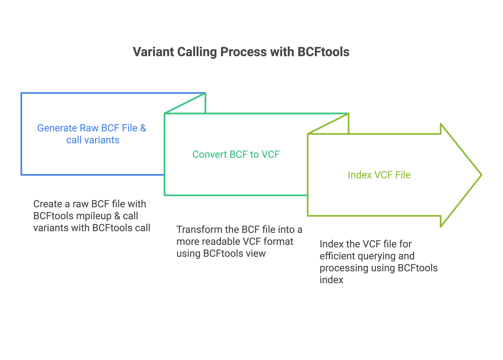

#### Okwir Julius  - `r Sys.Date()`

```{r setup, include=FALSE}
# Set the global working directory for all chunks
knitr::opts_knit$set(root.dir = "/Users/oj/Documents/bioinformatics/variant_calling/vc_project")

# Set global chunk options
knitr::opts_chunk$set(
  eval = FALSE,     # Evaluate all chunks by default
  echo = TRUE,      # Display code in the output
  results = "hide", # Hide results unless explicitly overridden
  comment = ""      # Suppress '##' in chunk output
)
```

## Introduction
Variant calling is an important step in bioinformatics for identifying genetic differences such as Single Nucleotide Polymorphisms (SNPs) and small insertions or deletions (indels) in genomic sequences. These variants can reveal important information about genetic diversity, pathogenicity, and antibiotic resistance in bacterial genomes. For beginners, think of variant calling as playing a game of "spot the difference" between a sample and a reference genomic sequence. Variant annotation pinpoints the regions or genes where these differences occur, and variant effect prediction identifies their potential implications.  


This beginner friendly tutorial offers a comprehensive step-by-step guide for variant calling, annotation, and effect prediction in bacterial genomes using *Salmonella enterica* as a case study. It uses beginner level bash commands and emphasizes automation and reproducibility with bash scripting to ease routine variant analysis tasks. By the end, you will be able to:  
1. Perform variant analysis on bacterial samples  
2. Automate quality control, alignment, variant calling, annotation, and effect prediction steps with custom bash scripts  
3. Build a single end-to-end automated custom bash pipeline for variant analysis

---

## Installation/setup
### Step 1: Install Anaconda (if absent)
[Anaconda](https://docs.anaconda.com/getting-started/#) is a popular distribution of R and python that eases package management and environments. It comes with the Conda package and environment manager. Install Anaconda and use Conda to set up a dedicated environment with all the tools needed for variant analysis.

```{bash}
# Download the Anaconda installer for macOS (check for latest version)
curl -O https://repo.anaconda.com/archive/Anaconda3-2024.10-1-MacOSX-arm64.sh

# Download the Anaconda installer for Linux (check for latest version)
wget https://repo.anaconda.com/archive/Anaconda3-2024.10-1-Linux-x86_64.sh

# Run the installer for MacOS
bash ~/Anaconda3-2024.10-1-MacOSX-arm64.sh

# Run the installer for Linux
bash ~/Anaconda3-2024.10-1-Linux-x86_64.sh

# Follow the prompts to complete the installation
# Restart your terminal 

# Verify installation
conda --version
```


### Step 2: Set up a dedicated Conda environment for variant analysis
Create an `environment.yml` file, which is a [YAML file](https://www.redhat.com/en/topics/automation/what-is-yaml) with a list of all the packages/tools that we need.

```{bash}
# create a yaml file (use your favorite bash editor - nano, pico, vim etc)
nano environment.yml
```

Add environment name, channels, and dependencies or tools as shown below, save the file and exit the editor.
```{bash, echo = FALSE, eval = TRUE, results = "show"}
cat environment.yml
```

Create and activate the `conda environment` with all the listed tools or dependencies
```{bash}
# create conda enviroment 
conda env create -f environment.yml

# activate conda environment
conda activate variant_analysis

# check the list of installed tools
conda list
```

### Step 3:  Set up the directory structure with reference genome and samples
To perform variant analysis, you need a reference genome file, annotation file , and the raw sequencing sample files. In this tutorial, these files were obtained from [this study](https://pmc.ncbi.nlm.nih.gov/articles/PMC10132074/#s4) and downloaded from NCBI. The reference genome ([FASTA format](https://www.ncbi.nlm.nih.gov/genbank/fastaformat/)) and annotation file ([GenBank format](https://www.ncbi.nlm.nih.gov/genbank/samplerecord/)) are available [here](https://www.ncbi.nlm.nih.gov/nuccore/CP000026), while the sample files ([FASTQ format](https://knowledge.illumina.com/software/general/software-general-reference_material-list/000002211)) can be accessed [here](https://www.ncbi.nlm.nih.gov/Traces/study/?query_key=13&WebEnv=MCID_6793311f4d895d5d7ca50eb7&o=acc_s%3Aa). To reduce processing time, this tutorial uses only the first 100,000 reads from each sample and analyzes only four [paired-end](https://www.illumina.com/science/technology/next-generation-sequencing/plan-experiments/paired-end-vs-single-read.html) samples. The reference genome, annotation, and sample files are provided as part of the tutorial.

```{bash}
# Create the project directory 'vc_project' along with subdirectories 'raw_reads' and 'reference' 
mkdir vc_project vc_project/raw_reads vc_project/reference

# Change into the working directory 'vc_project'
# Note: vc_project is the working directory throughout the entire analysis
cd vc_project

# Copy FASTQ sample files into the 'raw_reads' directory and the reference genome and annotation file into the 'reference' directory
```

##### Output
```{bash}
.
├── raw_reads/                   # Directory with raw FASTQ samples
│   ├── ERR10445546_1.fastq.gz  # Forward raw reads for sample ERR10445546
│   ├── ERR10445546_2.fastq.gz  # Reverse raw reads for sample ERR10445546
│   ├── ERR10445547_1.fastq.gz  # Forward raw reads for sample ERR10445547
│   ├── ERR10445547_2.fastq.gz  # Reverse raw reads for sample ERR10445547
│   ├── ERR10445548_1.fastq.gz  # Forward raw reads for sample ERR10445548
│   ├── ERR10445548_2.fastq.gz  # Reverse raw reads for sample ERR10445548
│   ├── ERR10445549_1.fastq.gz  # Forward raw reads for sample ERR10445549
│   └── ERR10445549_2.fastq.gz  # Reverse raw reads for sample ERR10445549
└── reference/                   # Directory with reference genome and annotation file
    ├── Salmonella_enterica.fasta  # Reference genome in FASTA format
    └── Salmonella_enterica.gb     # Reference genome in GenBank format (Annotation file)
```

---

## The workflow


---

## Quality Control (Quality checks and trimming)
The quality control process typically involves three key steps:  

* Assess the quality of the raw sequencing reads to identify potential issues such as low-quality bases, adapter contamination, or sequence duplication 
* Trim low-quality bases, remove adapter sequences, remove duplicate sequences if necessary to improve the overall quality of the reads for downstream analyses  
* Reassess the quality of the trimmed reads to ensure they meet the necessary standards for downstream analyses.

These steps ensure that only high-quality reads are used in downstream analyses, minimizing errors and improving the reliability of variant calling results.


In this tutorial, we will use the following tools for quality control.  

* [**FastQC**](https://www.bioinformatics.babraham.ac.uk/projects/fastqc/)- To perform quality checks for each raw sequencing file, providing detailed metrics such as per-base quality, per-sequence quality, Sequence duplication, and adapter contamination  
* [**MultiQC**](https://docs.seqera.io/multiqc)- To aggregate the results from multiple FastQC reports into a single, comprehensive summary, making it easier to identify patterns or trends across all samples  
* [**Trim Galore**](https://github.com/FelixKrueger/TrimGalore)- To trim low-quality bases and remove adapter sequences from the reads. `Trim Galore` is a wrapper around `cutadapt` and includes automated adapter detection

### Step 1: Assess the quality of the raw sequencing reads with FastQC

Create the directory structure for storing the outputs of various stages of the quality control process:

```{bash}
# Create directories and subdirectories for QC reports and trimmed reads
mkdir -p raw_reads/qc_raw trimmed_reads/qc_trimmed
```

Explanation:  

* `mkdir`: Command to create directories  
* `-p`: Ensure that parent directories are created if they don’t exist and suppress errors if directories already exist.  

##### Output
```{bash}
raw_reads/              # Directory with raw FASTQ files
└── qc_raw/             # Subdirectory to store FastQC reports and MultiQC report for raw reads
trimmed_reads/          # Directory for trimmed FASTQ files
└── qc_trimmed/         # Subdirectory to store FastQC reports and MultiQC report for trimmed reads
```

Next, run FastQC on all raw FASTQ samples to assess their quality.  Note that FastQC assesses each file separately, so the quality of the forward and reverse reads for each sample are evaluated independently.

```{bash}
# Perform quality checks on raw reads
fastqc -o raw_reads/qc_raw raw_reads/*.fastq.gz
```

Explanation:  

* `fastqc`: Command to perform quality checks 
* `-o raw_reads/qc_raw`: Set the output directory for FastQC reports
* `raw_reads/*.fastq.gz`: Process all the FASTQ files in the raw_reads directory

Finally, aggregate the FastQC reports using MultiQC.

```{bash}
# Aggregate FastQC reports for raw reads
multiqc -f -o raw_reads/qc_raw -n multiqc_raw_report.html raw_reads/qc_raw
```

Explanation:  

* `multiqc`: Command to combines multiple FastQC reports into a single HTML summary  
* `-f`: Overwrite any existing MultiQC report 
* `-o raw_reads/qc_raw`: Set the output directory for the MultiQC report 
* `-n multiqc_raw_report.html`: Assign a custom name to the multiqc report
* `raw_reads/qc_raw`: Specify the input directory containing the FASTQC reports to be aggregated

##### Output 
```{bash}
raw_reads/                   # Directory containing raw FASTQ files and their FastQC reports
├── ERR10445546_1.fastq.gz   # Forward raw reads for sample ERR10445546
├── ERR10445546_2.fastq.gz   # Reverse raw reads for sample ERR10445546
├── ERR10445547_1.fastq.gz   # " " "
├── ERR10445547_2.fastq.gz   # " " "
├── ERR10445548_1.fastq.gz   # " " "
├── ERR10445548_2.fastq.gz   # " " "
├── ERR10445549_1.fastq.gz   # " " "
├── ERR10445549_2.fastq.gz   # " " "
└── qc_raw/                         # Subdirectory for FastQC reports on raw FASTQ files
    ├── ERR10445546_1_fastqc.html   # FastQC HTML report for ERR10445546 forward reads
    ├── ERR10445546_1_fastqc.zip    # FastQC archive for ERR10445546 forward reads
    ├── ERR10445546_2_fastqc.html   # FastQC HTML report for ERR10445546 reverse reads
    ├── ERR10445546_2_fastqc.zip    # FastQC archive for ERR10445546 reverse reads
    ├── ERR10445547_1_fastqc.html   # " " "
    ├── ERR10445547_1_fastqc.zip    # " " "
    ├── ERR10445547_2_fastqc.html   # " " "
    ├── ERR10445547_2_fastqc.zip    # " " "
    ├── ERR10445548_1_fastqc.html   # " " "
    ├── ERR10445548_1_fastqc.zip    # " " "
    ├── ERR10445548_2_fastqc.html   # " " "
    ├── ERR10445548_2_fastqc.zip    # " " "
    ├── ERR10445549_1_fastqc.html   # " " "
    ├── ERR10445549_1_fastqc.zip    # " " "
    ├── ERR10445549_2_fastqc.html   # " " "
    ├── ERR10445549_2_fastqc.zip    # " " "
    ├── multiqc_raw_report.html     # Aggregated MultiQC report for all raw FastQC reports
    └── multiqc_raw_report_data     # Supporting data for the aggregated MultiQC report

```


Key multiQC aggregated report sections from FastQC quality checks on all the raw sequencing reads  

1. Per Base Sequence Quality Scores:
    * Shows the distribution of base quality scores across all reads
    * Helps identify regions containing [low-quality bases](https://www.bioinformatics.babraham.ac.uk/projects/fastqc/Help/3%20Analysis%20Modules/2%20Per%20Base%20Sequence%20Quality.html), with FastQC issuing a warning when the median base quality (Phred score) falls below 25 and a failure when it drops below 20. Low quality bases can result in misalignment and false variant calls
2. Duplicate Sequences:
    * Reports the frequency of duplicate reads
    * A [high proportion](https://www.bioinformatics.babraham.ac.uk/projects/fastqc/Help/3%20Analysis%20Modules/8%20Duplicate%20Sequences.html) of duplicate sequences, indicated by FastQC warnings when exceeding 20% of total reads and failures when exceeding 50%, may indicate PCR over amplification or over-sequencing of certain fragments
3. Adapter Contamination:
    * Shows the extent of adapter sequences present in the reads
    * [High levels of adapter contamination](https://www.bioinformatics.babraham.ac.uk/projects/fastqc/Help/3%20Analysis%20Modules/10%20Adapter%20Content.html), indicated by FastQC warnings when exceeding 5% and failures when exceeding 10% of all reads, can lead to alignment errors and an increase in the number of unaligned reads


Based on the quality metrics above, trimming low quality reads, adaptor removal, and deduplication might not be strictly necessary. However, since the goal of this tutorial is to build an end-to-end automated variant analysis pipeline, This step is included.


### Step 2: Trim low-quality bases and remove adapter sequences with Trim Galore

After reviewing the quality  control reports, clean the data by trimming low-quality bases, removing adapter sequences, deduplication, etc if necessary. Use Trim Galore to process the paired-end reads. Start by running Trim Galore with a single sample to understand the command syntax and then later incorporate the command into a custom quality control bash script for processing multiple samples.

```{bash}
# Trim low-quality bases and remove adapters
trim_galore --paired \
            --quality 20 \ # default quality score
            --output_dir trimmed_reads \
            raw_reads/ERR10445546_1.fastq.gz raw_reads/ERR10445546_2.fastq.gz
```

Explanation: 

* `trim_galore`: Automatically detects and removes adapters, trims low-quality bases, and filters out short sequences 
* `--paired`: Specify paired-end mode to process the two input files simultaneously  
* `--quality 20`: Trim bases with a Phred quality score < 20 (99% base call accuracy) 
* `--output_dir trimmed_reads`: Save the trimmed FASTQ files in the `trimmed_reads` directory  
* `raw_reads/ERR10445546_1.fastq.gz`: Specify the input forward reads
* `raw_reads/ERR10445546_2.fastq.gz`: Specify the input reverse reads 


### Step 3: Reassess the quality of the trimmed reads with FastQC

After trimming, reassess the quality of the trimmed reads to ensure they are satisfactory. Use FastQC and MultiQC to generate and aggregate QC reports respectively. Trim Galore also produces a quality assessment report that can also be aggregated with MultiQC. Note that quality checks on the trimmed reads can conveniently be performed directly by specifying the `--fastqc` option in Trim Galore. Doing so will combine steps 2 & 3 as indicated in the "Automate quality control" section.

```{bash}
# move trim galore reports to the qc_trimmed directory
mv trimmed_reads/*_trimming_report.txt trimmed_reads/qc_trimmed

# Aggregate Trim Galore reports (optional)
multiqc -f -o trimmed_reads/qc_trimmed -n trim_galore_report.html trimmed_reads/qc_trimmed

# Perform quality checks on trimmed reads
fastqc -o trimmed_reads/qc_trimmed trimmed_reads/*.fq.gz

# Aggregate FastQC reports for trimmed reads
multiqc -o trimmed_reads/qc_trimmed -n multiqc_trimmed_report.html trimmed_reads/qc_trimmed
```

---

### Automate Quality Control with a bash script
To ensure processing of multiple samples, create a new file in your favorite editor and write a bash script (automate_qc.sh) that automates the above process as shown below. The script incorperates most commands from the Quality control section and should be familiar. 

```{bash, echo = FALSE, eval = TRUE, results = "show"}
cat automate_qc.sh
```

Run the bash script using the command `bash automate_qc.sh` from the working directory (vc_project). Do not forget that `vc_project` is the working directory throughout the entire analysis as previously stated.

---

##### Output
```{bash}
trimmed_reads/                  # Directory containing trimmed FASTQ files and their FastQC reports
├── ERR10445546_1_val_1.fq.gz   # Forward trimmed reads for sample ERR10445546
├── ERR10445546_2_val_2.fq.gz   # Reverse trimmed reads for sample ERR10445546
├── ERR10445547_1_val_1.fq.gz   # " " "
├── ERR10445547_2_val_2.fq.gz   # " " "
├── ERR10445548_1_val_1.fq.gz   # " " "
├── ERR10445548_2_val_2.fq.gz   # " " "
├── ERR10445549_1_val_1.fq.gz   # " " "
├── ERR10445549_2_val_2.fq.gz   # " " "
└── qc_trimmed/                                      # Subdirectory for FastQC reports on trimmed reads
    ├── ERR10445546_1.fastq.gz_trimming_report.txt   # Trim Galore report for ERR10445546 forward reads
    ├── ERR10445546_1_val_1_fastqc.html              # FastQC HTML report for ERR10445546 forward reads
    ├── ERR10445546_1_val_1_fastqc.zip               # FastQC archive for ERR10445546 forward reads
    ├── ERR10445546_2.fastq.gz_trimming_report.txt   # Trim Galore report for ERR10445546 reverse reads
    ├── ERR10445546_2_val_2_fastqc.html              # FastQC HTML report for ERR10445546 reverse reads
    ├── ERR10445546_2_val_2_fastqc.zip               # FastQC archive for ERR10445546 reverse reads
    ├── ERR10445547_1.fastq.gz_trimming_report.txt   # " " "
    ├── ERR10445547_1_val_1_fastqc.html              # " " "
    ├── ERR10445547_1_val_1_fastqc.zip               # " " "
    ├── ERR10445547_2.fastq.gz_trimming_report.txt   # " " "
    ├── ERR10445547_2_val_2_fastqc.html              # " " "
    ├── ERR10445547_2_val_2_fastqc.zip               # " " "
    ├── ERR10445548_1.fastq.gz_trimming_report.txt   # " " "
    ├── ERR10445548_1_val_1_fastqc.html              # " " "
    ├── ERR10445548_1_val_1_fastqc.zip               # " " "
    ├── ERR10445548_2.fastq.gz_trimming_report.txt   # " " "
    ├── ERR10445548_2_val_2_fastqc.html              # " " "
    ├── ERR10445548_2_val_2_fastqc.zip               # " " "
    ├── ERR10445549_1.fastq.gz_trimming_report.txt   # " " "
    ├── ERR10445549_1_val_1_fastqc.html              # " " "
    ├── ERR10445549_1_val_1_fastqc.zip               # " " "
    ├── ERR10445549_2.fastq.gz_trimming_report.txt   # " " "
    ├── ERR10445549_2_val_2_fastqc.html              # " " "
    ├── ERR10445549_2_val_2_fastqc.zip               # " " "
    ├── multiqc_trimmed_report.html                # Aggregated MultiQC report for all trimmed FastQC reports
    ├── multiqc_trimmed_report_data                # Supporting data for the aggregated MultiQC report
    ├── trim_galore_report.html                    # Aggregated Trim Galore report for all trimmed reads
    └── trim_galore_report_data                    # Supporting data for the Trim Galore report


```
   

Key multiqc report sections from FastQC quality checks on all trimmed sequencing reads


Note that not much has changed after trimming because the raw reads were already of acceptable quality for this analysis.

---

### Alternative Tools for Quality Control
(i) [**`fastp`**](https://github.com/OpenGene/fastp):  
   - A fast all-in-one preprocessing and quality control for FastQ data 
   - Combines quality assessment, trimming, and report generation into a single step.  
   - Key Features:  
     - Filter low quality reads
     - Read deduplication  
     - Adapter removal

(ii) [**`Trimmomatic`**](https://github.com/usadellab/Trimmomatic):  
   - A common bioinformatics tool for read trimming with customizable options 
   - Offers more trimming parameters compared to Trim Galore 
   - Key Features:  
     - Adapter removal with `ILLUMINACLIP`  
     - Trimming based on quality (`LEADING`, `TRAILING`, `SLIDINGWINDOW`)
     - Remove reads that are below specified length (`MINLEN`)

---

###  Quality Control tips
1. **Review QC metrics carefully**: Pay attention to key metrics like per-base sequence quality,  adapter contamination, and duplicate sequences. These can provide insights into potential issues with the sequencing data.
2. **Adjust trimming parameters**: If you observe persistent low-quality regions in the reads, consider increasing the quality threshold (e.g., `--quality 30`). However, be cautious not to over-trim, as excessive trimming may remove valuable data.  
3. **Use custom adapters**: If your sequencing platform or library preparation introduces unique adapters, specify them explicitly in Trim Galore using the `--adapter` option.

---

## Alignment
After quality control, the next step is to align the trimmed reads to a reference genome. Use [**`BWA`**](https://github.com/lh3/bwa) for alignment and [**`SAMtools`**](https://www.htslib.org/doc/samtools.html) for post-alignment processing.


### Step 1: Index the Reference Genome
Before aligning the reads, the reference genome must be indexed. Indexing enables the alignment tool (BWA) to quickly search and map sequencing reads to the reference genome, significantly improving alignment efficiency.

```{bash}
# Create directories to organize output
mkdir -p alignment alignment/stats

# Index the reference genome using BWA
bwa index reference/Salmonella_enterica.fasta
```

### Step 2: Align Trimmed Reads to the Reference Genome
After indexing, align the trimmed paired-end reads to the reference genome using the BWA-MEM algorithm.

```{bash}
bwa mem -t 4 reference/Salmonella_enterica.fasta \
    trimmed_reads/ERR10445546_1_val_1.fq.gz trimmed_reads/ERR10445546_2_val_2.fq.gz \
    > alignment/ERR10445546.sam
```

Explanation:

* `bwa mem`: Run the BWA-MEM algorithm, optimized for long reads 
* `-t 4`: Specify the number of threads for parallel processing
* `reference/Salmonella_enterica.fasta`: Path to the indexed reference genome 
* `trimmed_reads/ERR10445546_1_val_1.fq.gz`: Input Forward trimmed reads 
* `trimmed_reads/ERR10445546_2_val_2.fq.gz`: Input Reverse trimmed reads


### Step 3: Post-Alignment Processing
Once the reads are aligned, several processing steps are required to convert the [SAM file](https://pmc.ncbi.nlm.nih.gov/articles/PMC2723002/) into a more efficient [BAM](https://support.illumina.com/help/BS_App_RNASeq_Alignment_OLH_1000000006112/Content/Source/Informatics/BAM-Format.htm) format, sort it by genomic coordinates, mark duplicates, and index it for downstream applications.

#### Convert SAM to Sorted BAM and mark duplicate sequences
```{bash}
# Convert SAM to BAM and sort the BAM file
samtools view -S -b alignment/ERR10445546.sam | samtools sort -o alignment/ERR10445546.sorted.bam

# mark duplicate reads
picard MarkDuplicates -INPUT alignment/ERR10445546.sorted.bam \
                      -OUTPUT alignment/ERR10445546.sorted.dedup.bam \
                      -METRICS_FILE alignment/stats/ERR10445546.dedup.txt
```

Explanation:

* `samtools view -S -b`: Converts the SAM file to BAM format, reducing file size and improving processing speed 
* `samtools sort`: Organise the BAM file by genomic coordinates for efficient querying and compatibility with downstream tools.
* `picard MarkDuplicates`: Mark duplicate reads
* `-INPUT`: Input sorted BAM file
* `-OUTPUT`: Output deduplicated BAM file
* `-METRICS`: Deduplication metrics

Marking duplicates prevents false-positive variant calls by distinguishing PCR duplicate reads from true independent reads.


#### Index the Sorted BAM File
```{bash}
# Index the sorted BAM file
samtools index alignment/ERR10445546.sorted.dedup.bam
```

Explanation:
- `samtools index`: Creates an index for the sorted BAM file, enabling rapid access to specific genomic regions without scanning the entire BAM file.


#### Generate Alignment Statistics
We can generate alignment summary statistics with SAMtools `flagstat` and detailed statistics with samtools `stats`
```{bash}
# summary statistics
samtools flagstat alignment/ERR10445546.sorted.dedup.bam > alignment/stats/ERR10445546.flagstat

# detailed statistics
samtools stats alignment/ERR10445546.sorted.dedup.bam > alignment/stats/ERR10445546.stats

# aggregate alignment stats with multiqc
multiqc -f -o alignment/stats/ -n multiqc_alignment_report.html alignment/stats/
```

Explanation:

* `samtools flagstat`: Produces a summary of the alignment, including the total number of reads, mapped reads, and duplicates  
* `samtools stats`: Generates a detailed statistical report, including metrics like mapping quality, insert size metrics, and error rates


---

### Automate aligment with a bash script
To ensure that we process multiple samples, write a bash script (automate_algnmnt.sh) to automate the entire alignment process. Details of the script are shown below. The script incorporates most commands from the Alignment section and should be familiar. 
```{bash, echo = FALSE, eval = TRUE, results = "show"}
cat automate_algnmt.sh
```

Run the bash script using the command `bash automate_algnmnt.sh`

---

#### Output
```{bash}
reference/
├── Salmonella_enterica.fasta          # Reference genome in FASTA format
├── Salmonella_enterica.fasta.amb      # BWA index file: ambiguous bases
├── Salmonella_enterica.fasta.ann      # BWA index file: annotations for the reference
├── Salmonella_enterica.fasta.bwt      # BWA index file: Burrows-Wheeler Transform index
├── Salmonella_enterica.fasta.pac      # BWA index file: PacBio-specific index data
├── Salmonella_enterica.fasta.sa       # BWA index file: suffix array
└── Salmonella_enterica.gb             # Reference genome in GenBank format (Annotation file)

alignment/
├── ERR10445546.sorted.bam             # Sorted BAM file for sample ERR10445546
├── ERR10445546.sorted.dedup.bam       # Deduplicated BAM file for sample ERR10445546
├── ERR10445546.sorted.dedup.bam.bai   # BAM index for deduplicated sample ERR10445546
├── ERR10445547.sorted.bam             # " " "
├── ERR10445547.sorted.dedup.bam       # " " "
├── ERR10445547.sorted.dedup.bam.bai   # " " "
├── ERR10445548.sorted.bam             # " " "
├── ERR10445548.sorted.dedup.bam       # " " "
├── ERR10445548.sorted.dedup.bam.bai   # " " "
├── ERR10445549.sorted.bam             # " " "
├── ERR10445549.sorted.dedup.bam       # " " "
├── ERR10445549.sorted.dedup.bam.bai   # " " "
├── bam_list.txt                       # List of the deduplicated BAM files for use in variant calling
└── stats/                             # Subdirectory for alignment statistics and QC reports
    ├── ERR10445546.dedup.txt          # Duplicate marking metrics for sample ERR10445546
    ├── ERR10445546.flagstat           # Alignment summary statistics for sample ERR10445546
    ├── ERR10445546.stats              # Detailed alignment statistics for sample ERR10445546
    ├── ERR10445547.dedup.txt          # " " "
    ├── ERR10445547.flagstat           # " " "
    ├── ERR10445547.stats              # " " "
    ├── ERR10445548.dedup.txt          # " " "
    ├── ERR10445548.flagstat           # " " "
    ├── ERR10445548.stats              # " " "
    ├── ERR10445549.dedup.txt          # " " "
    ├── ERR10445549.flagstat           # " " "
    ├── ERR10445549.stats              # " " "
    ├── multiqc_alignment_report.html  # Aggregated MultiQC report for alignment metrics
    └── multiqc_alignment_report_data  # Supporting data files for the MultiQC report


```

Multiqc report sections from alignment and post alignment processing of all trimmed sequencing reads


---

### Alternative Tools for Alignment
1. [**`Bowtie2`**](https://bowtie-bio.sourceforge.net/bowtie2/index.shtml):
   - A common tool for aligning sequencing reads to long reference sequences.
   
2. [**`minimap2`**](https://github.com/lh3/minimap2):
   - Recommended for aligning long reads from Oxford Nanopore or PacBio.
   
---

### Tips for Alignment
1. **Use sufficient threads**: Adjust the `-t` option in `bwa mem` to match the number of available CPU cores for faster alignment.
2. **Monitor output file sizes**: SAM files are large; convert to BAM format immediately to save storage space.
3. **Add Read Group fnformation**: Add read group information (e.g., `@RG`) during alignment for multi-sample workflows.

---

## Variant calling
After aligning the reads to the reference genome, the next step is to perform variant calling to identify genetic variations such as SNPs (Single Nucleotide Polymorphisms) and indels (insertions/deletions). Use [BCFtools](https://samtools.github.io/bcftools/howtos/index.html) for variant calling and processing. BCFtools generates a BCF file, which is the binary version of a [VCF file](https://pmc.ncbi.nlm.nih.gov/articles/PMC3137218/). The BCF file is more compact and can be processed efficiently. If needed, the BCF file can be converted to the more widely used VCF file for downstream analysis.





### Step 1: Generate a Raw BCF File with BCFtools mpileup and call variants
Create a directory to store the variant calling results.
```{bash}
# Create a directory to organize output
mkdir -p variants
```

To call variants, first generate a pileup of aligned reads using `bcftools mpileup`.
```{bash}
# Generate a raw BCF file with BCFtools mpileup
bcftools mpileup -Ou -f reference/Salmonella_enterica.fasta alignment/ERR10445546.sorted.dedup.bam > variants/variants.bcf
```

Explanation:

* `bcftools mpileup`: Computes the pileup of reads and generates an intermediate BCF file
* `-Ou`: Outputs an uncompressed BCF file for efficient downstream processing
* `-f reference/Salmonella_enterica.fasta`: Specifies the reference genome to ensure correct variant calling


Use `bcftools call` to identify SNPs and indels from the raw BCF file.
```{bash}
# Call variants
bcftools call -mv --ploidy 1 -Ob -o variants/called_variants.bcf variants/variants.bcf
```

Explanation:

* `bcftools call`: Calls genetic variants from the BCF file.
* `-mv`: Calls both SNPs and indels, allowing for multiallelic sites.
* `--ploidy 1`: Specifies a haploid genome, which is appropriate for bacteria and other prokaryotes
* `-Ob`: Outputs a compressed BCF file for storage efficiency.

### Step 2: Convert BCF to VCF for Easier Interpretation
Since the VCF file is more widely used, convert the BCF file to VCF.

```{bash}
# Convert BCF to VCF
bcftools view variants/called_variants.bcf > variants/called_variants.vcf
```

Explanation: 

* `bcftools view`: Converts the BCF file to VCF format, making it human-readable 

### Step 3: Index the final VCF File and generate variant calling statistics
Indexing the VCF file allows for faster querying and efficient downstream processing.

```{bash}
# create a compressed vcf file
bgzip -c variants/called_variants.vcf > variants/called_variants.vcf.gz

# Index the VCF file
bcftools index variants/called_variants.vcf.gz
```

Command and tools:

* `bcftools index`: Creates an index file for the VCF file, enabling rapid querying of variants.

```{bash}
# Generate stats
bcftools stats $variants_dir/called_variants.vcf.gz > $variants_dir/bcf_stats.txt
```

---

### Automate variant calling with a bash script
To call variants from multiple samples, automate the variant calling process by writing a bash script (automate_vc.sh) as shown below.
```{bash, echo = FALSE, eval = TRUE, results = "show"}
cat automate_vc.sh
```

Run the script using the command `bash automate_vc.sh`

---

##### output
```{bash}
variants/
├── bcf_stats.txt              # Statistics from variant calling 
├── called_variants.bcf        # Called variants in binary BCF format generated by bcftools call
├── called_variants.vcf        # Human-readable VCF file converted from the binary BCF output
├── called_variants.vcf.gz     # Compressed VCF file (BGZF format) for efficient storage and downstream processing
├── called_variants.vcf.gz.csi # Index file for the compressed VCF, enabling rapid access to variant data
└── variants.bcf               # Raw BCF file produced by bcftools mpileup from the alignment data

```

---

### Alternative Tools for Variant Calling
1. [**`GATK HaplotypeCaller`**](https://gatk.broadinstitute.org/hc/en-us/articles/360037225632-HaplotypeCaller):
   - More advanced variant caller commonly used for diploid genomes but can be applied to prokaryotes.

2. [**`FreeBayes`**](https://github.com/freebayes/freebayes):
   -Popular variant caller used with haploid or polyploid genomes to detect SNPs, indels, MNPs, insertions and substitutions


3. [**`LoFreq`**](https://csb5.github.io/lofreq/):
   - High-sensitivity variant caller that can be optimized to cater for low quality variants.

---

### Tips for Variant calling
1. **Adjust variant calling sensitivity**: Use `--variants-only` to remove non-variant sites 
2. **Compress and index VCF for storage efficiency**: Convert the VCF file to BGZF format using `bcftools view -Oz` and index it with `bcftools index`.
3. **Check variant quality**: Use `bcftools filter` to retain high-confidence variants (e.g., `QUAL > 30`).

---

## Variant Annotation and Effect Prediction
After variant calling, the next step is to annotate the variants and predict their functional effects. We will use [SnpEff](https://pcingola.github.io/SnpEff/) for annotation and effect prediction, and BCFtools for filtering variants of interest.


### Step 1: Build a custom database with SnpEff
SnpEff requires an annotation database to annotate variants. If a database for your organism is not available (very unlikely), you need to build a custom database. We will use the GenBank reference file to build a custom database. 

#### Copy and modify SnpEff configuration file
The **SnpEff configuration file** (`snpEff.config`) is usually found in the SnpEff installation directory. Create a copy of this file and modify it to include our organism. Using a copy of the snpEff.config file ensures that the original configuration file and functionality of snpEff is not tampered with.

```{bash}
# Create output directory
mkdir -p annotation

# Copy SnpEff configuration file from snpEff installation directory into the annotation directory
cp /path/to/anaconda3/pkgs/snpeff-5.2-hdfd78af_1/share/snpeff-5.2-1/snpEff.config annotation/snpEff_copy.config
```

#### Edit the configuration file
"Add an entry" for the organism at the end of the copied configuration file.

```{bash}
# Append custom genome entry to the config file
echo "# Salmonella enterica" >> annotation/snpEff_copy.config
echo "Salmonella_enterica.genome : Salmonella enterica, complete genome" >> annotation/snpEff_copy.config
```

#### Prepare data directory and annotation file
For this approach, SnpEff requires the annotation file in **GenBank (.gbk) format**. Create a directory for the organism and place the annotation file inside this directory.

```{bash}
# Create directory structure for custom database
mkdir -p annotation/data annotation/data/Salmonella_enterica

# Copy the reference genome to the new directory
cp reference/Salmonella_enterica.gb annotation/data/Salmonella_enterica/genes.gbk
```

#### Build the custom database
Now, build the SnpEff database using the **GenBank reference file**.

```{bash}
# Build the SnpEff database
snpEff build -genbank -c annotation/snpEff_copy.config -v Salmonella_enterica
```

Explanation:

* `snpEff build`: Builds a custom annotation database.
* `-genbank`: Specifies that the reference is in GenBank format.
* `-c annotation/snpEff_copy.config`: Uses our modified configuration file.
* `-v`: Enables verbose output to monitor progress.
* `Salmonella_enterica`: The custom genome name added in the configuration file.

### Step 2: Annotate and predict effect of variants
Once the database is built, we can annotate the called variants (VCF file).

```{bash}
# Annotate variants and predict functional effects
snpEff ann -o vcf -c annotation/snpEff_copy.config Salmonella_enterica /variants/called_variants.vcf.gz > annotation/ann_called_variants.vcf
```

Explanation:

* `snpEff ann`: Runs annotation on the variant file
* `-o vcf`: Outputs results in VCF format
* `-c annotation/snpEff_copy.config`: Uses the custom database configuration file
* `Salmonella_enterica`: The genome name specified during database creation
* `/variants/called_variants.vcf.gz`: The input VCF file from variant calling

---

### Automate variant annotation and effect prediction
We can automate the entire process of annotation and effect prediction using a custom database with a bash script (automate_ann.effect.sh) as shown below.
```{bash, echo = FALSE, eval=TRUE, results="show"}
cat automate_ann.effect.sh
```

Run the script using the command `bash automate_ann.effect.sh`.

---

##### Output
```{bash}
annotation/                          # Directory for variant annotation outputs and database
├── ann_called_variants.vcf          # Final annotated VCF file with predicted variant effects
├── data/                            # Subdirectory with the custom snpEff database data
│   └── Salmonella_enterica/         # Custom database subdirectory for Salmonella enterica
│       ├── genes.gbk                # GenBank file used to build the custom snpEff database
│       ├── sequence.CP000026.1.bin  # Binary file containing sequence data for snpEff
│       └── snpEffectPredictor.bin   # Binary file with precomputed effect prediction data
├── snpEff_summary.genes.txt         # Text summary report of gene-level annotations by snpEff
├── snpEff_summary.html              # HTML summary report providing an overview of variant annotations
└── snpeff_copy.config               # Copy of snpEff configuration file used to build the custom database

```

snpEff HTML report sections from variant annotation and effect prediction. 


---

### Step 3: Filter variants of interest with BCFtools
BCFtools provides multiple filtering options to extract specific **high-confidence or functionally relevant** variants as per the objectives of your project/research.

#### Example 1: Filter variants by type 
```{bash}
# Extract SNPs
bcftools view -v snps annotation/ann_called_variants.vcf > annotation/snps_only.vcf

# Extract indels
bcftools view -v indels annotation/ann_called_variants.vcf > annotation/indels_only.vcf
```

#### Example 2: Filter Variants by impact
```{bash}
# Extract variants with HIGH impact
bcftools filter -i 'INFO/ANN~"HIGH"' annotation/ann_called_variants.vcf > annotation/high_impact_variants.vcf

# Extract variants with MODERATE impact
bcftools filter -i 'INFO/ANN~"MODERATE"' annotation/ann_called_variants.vcf > annotation/moderate_impact_variants.vcf

# Extract variants with LOW impact
bcftools filter -i 'INFO/ANN~"LOW"' annotation/ann_called_variants.vcf > annotation/low_impact_variants.vcf
```

#### Example 3: Filter variants by functional class
```{bash}
# Extract non-synonymous variants (missense)
bcftools filter -i 'INFO/ANN~"missense_variant"' annotation/ann_called_variants.vcf > annotation/missense_variants.vcf

# Extract synonymous variants (silent)
bcftools filter -i 'INFO/ANN~"synonymous_variant"' annotation/ann_called_variants.vcf > annotation/synonymous_variants.vcf

# Extract nonsense variants (stop-gain)
bcftools filter -i 'INFO/ANN~"stop_gained"' annotation/ann_called_variants.vcf > annotation/stop_gained_variants.vcf
```

#### Example 4: Filter Variants in Specific Gene
```{bash}
# Filter variants located in gene gyrA
bcftools filter -i 'INFO/ANN~"gyrA"' annotation/ann_called_variants.vcf > annotation/gyrA_variants.vcf

```

#### Example 5: Filter Variants with Quality Score ≥ 30
```{bash}
# Filter variants with QUAL ≥ 30
bcftools filter -i "QUAL >= 30" annotation/ann_called_variants.vcf > annotation/high_quality_variants.vcf
```

#### Example 6: Combine multiple filters
```{bash}
# Extract SNPs with QUAL>=30 and are missense variants
bcftools filter -i 'TYPE="snp" && QUAL>=30 && INFO/ANN~"missense_variant"' annotation/ann_called_variants.vcf

# Extract SNPs of HIGH impact and are missense variants
bcftools filter -i 'TYPE="snp" && INFO/ANN~"HIGH" && INFO/ANN~"missense_variant"' annotation/ann_called_variants.vcf
```

---

### Alternative Tools for Variant Annotation and effect prediction
1. [**`VEP (Variant Effect Predictor)`**](https://www.ensembl.org/info/docs/tools/vep/script/vep_options.html):
   - Developed by Ensembl, supports extensive annotations.

2. [**`ANNOVAR`**](https://github.com/WGLab/doc-ANNOVAR):
   - Widely used for functional annotation of variants from diverse genomes

3. [**`BCFtools csq`**](https://samtools.github.io/bcftools/bcftools.html#csq):
   - Provides simple and fast annotations

---

### Tips for variant annotation and effect prediction 
1. **Ensure database completeness**. Check that the GenBank file contains CDS annotations; otherwise, functional predictions may be missing
2. **Combine multiple filters**. Use `&& (AND)` and `|| (OR)` conditions in `bcftools filter` to refine your variant selection.
3. **Create and use a copy of the snpEff configuration file**. Before making any modifications, create a duplicate of the snpEff configuration file. Customize and use this copied version for your analysis, while preserving the original file unchanged for future reference

---

### Automate the entire Bacterial variant analysis process
Integrating all steps of quality control, alignment and post-alignment processing, variant calling, variant annotation, and effect prediction into a single bash script (automate_variant_analysis.sh) creates a comprehensive, end-to-end bacterial variant analysis pipeline. The one script to rule them all.
```{bash,echo = FALSE, eval=TRUE, results="show"}
cat automate_variant_analysis.sh
```

Run the above script using the command `bash automate_variant_analysis.sh`.  This script should run successfully after the `Installation/setup` stage.

---

#### Tips to improve  the bacterial variant analysis custom pipeline
Once comfortable with the commands and different steps in variant analysis pipeline, consider making the following improvements.

1. **Use parallel processing**. Instead of sequentially iterating through samples with for loops, use tools such as `GNU Parallel` or `xargs` to execute tasks concurrently. This significantly reduces overall processing time.
2. **Improve error handling and logging**. Add additional checkpoints throughout the script to validate the success of each step. Improve error handling by capturing exit statuses and generating log files. This  will greatly improve troubleshooting.
3. **Adopt workflow management tools**. Consider using workflow managers like `Snakemake` or `Nextflow`. These tools can be used to create reproducible and scalable data analysis pipelines.

---

#### Common variant analysis tools
1. [**Snippy**](https://github.com/tseemann/snippy). A fast and user-friendly pipeline tailored for bacterial variant calling
2. [**Bactopia**](https://github.com/bactopia/bactopia). A pipeline for the complete analysis of bacterial genomes
3. [**Tormes**](https://github.com/nmquijada/tormes). A pipeline for whole bacterial genome analysis


---

#### Have questions or need assistance?
If you need help or have any queries regarding this tutorial or pipeline, please don't hesitate to reach out:

* Email: amjuliusokwir@gmail.com 
* GitHub Issues: Report issues or suggest improvements [here](https://github.com/okwir-julius/variant_analysis/issues).

---

## References

1. Andrews, S. (2010). FastQC: A quality control tool for high throughput sequence data. Retrieved March 4, 2025, from https://www.bioinformatics.babraham.ac.uk/projects/fastqc/ 

2. Broad Institute. (2019). Picard Toolkit [Computer software]. Retrieved February 18, 2025, from http://broadinstitute.github.io/picard/ 

3. Cingolani, P., Platts, A., Wang, L. L., Coon, M., Nguyen, T., Wang, L., Land, S. J., Lu, X., & Ruden, D. M. (2012). A program for annotating and predicting the effects of single nucleotide polymorphisms, SnpEff: SNPs in the genome of Drosophila melanogaster strain w1118; iso-2; iso-3. Fly, 6(2), 80–92. https://doi.org/10.4161/fly.19695 

4. Cornish, A., & Guda, C. (2015). A comparison of variant calling pipelines using Genome in a Bottle as a reference. BioMed Research International, 2015, 456479. https://doi.org/10.1155/2015/456479 

5. Danecek, P., Bonfield, J. K., Liddle, J., Marshall, J., Ohan, V., Pollard, M. O., Whitwham, A., Keane, T., McCarthy, S. A., Davies, R. M., & Li, H. (2021). Twelve years of SAMtools and BCFtools. GigaScience, 10(2), giab008. https://doi.org/10.1093/gigascience/giab008 

6. Ewels, P., Magnusson, M., Lundin, S., & Käller, M. (2016). MultiQC: Summarize analysis results for multiple tools and samples in a single report. Bioinformatics, 32(19), 3047–3048. https://doi.org/10.1093/bioinformatics/btw354 

7. Krueger, F. (2012). Trim Galore! [Computer software]. Babraham Bioinformatics. Retrieved February 4, 2025, from https://www.bioinformatics.babraham.ac.uk/projects/trim_galore/ 

8. Li, H., & Durbin, R. (2009). Fast and accurate short read alignment with Burrows–Wheeler transform. Bioinformatics, 25(14), 1754–1760. https://doi.org/10.1093/bioinformatics/btp324 

9. Li, H., Handsaker, B., Wysoker, A., Fennell, T., Ruan, J., Homer, N., Marth, G., Abecasis, G., & Durbin, R. (2009). The Sequence Alignment/Map format and SAMtools. Bioinformatics, 25(16), 2078–2079. https://doi.org/10.1093/bioinformatics/btp352

10. Zverinova, S., & Guryev, V. (2022). Variant calling: Considerations, practices, and developments. Human Mutation, 43(8), 976–985. https://doi.org/10.1002/humu.24311

---


